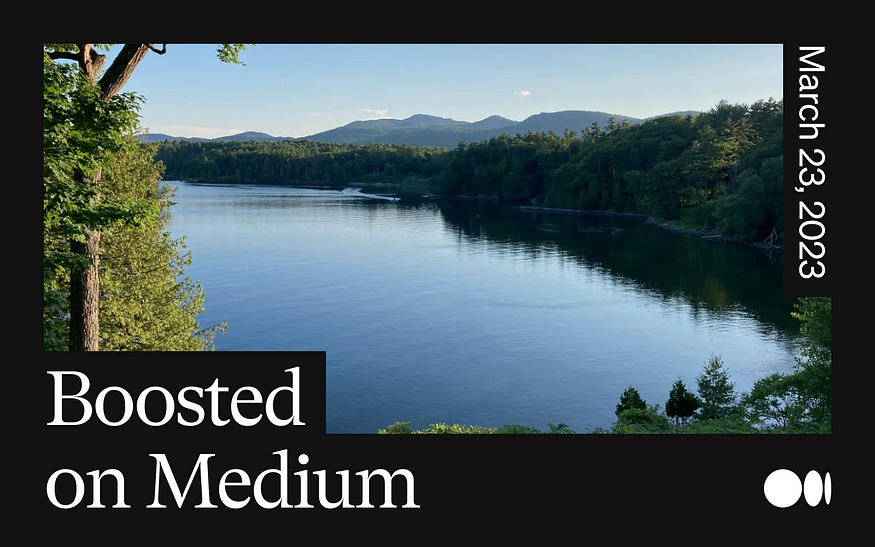
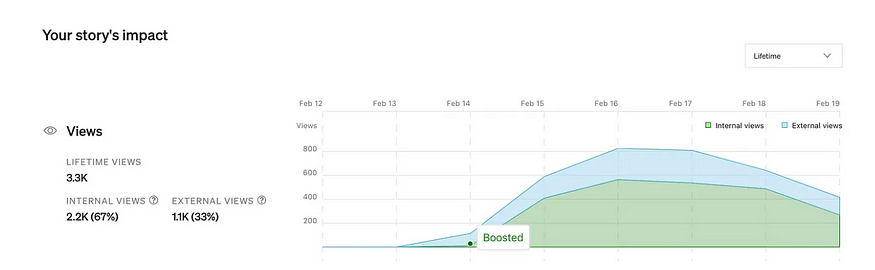
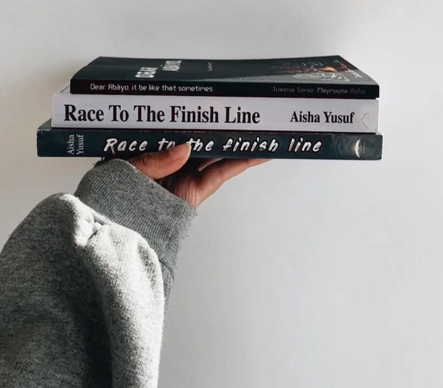

Image: [Camp Dudley](https://www.campdudley.org/dudley-for-boys/), Westport, NY (via  
图片：达德利营，韦斯特波特，纽约（来自)

## A few stories publication editors have selected for a boost  
一些故事出版编辑选择了提升

Last month, we introduced [a new Boost for top stories on Medium](https://blog.medium.com/a-new-boost-for-top-stories-541884654fdb). If you’re a writer who’s had a story Boosted, you’ll probably recognize this alert from your stats page…  
上个月，我们为 Medium 上的头条新闻推出了新的 Boost。如果您是一位写过 Boosted 故事的作家，您可能会从您的统计页面中识别出此警报……

Boosted!

We recommend “Boosted” stories to interested readers across Medium’s homepage, apps, and our Daily Digest email, which goes out to millions of people each day. Our goal is for every Boosted story to receive at least 500 views within the first week. We’re tracking this, and it’s working! Often, our initial push is enough to tip these stories into a much wider readership, and we’ve seen boosts between 500 and 100K views so far. You can read more on how it’s going [here](https://blog.medium.com/a-new-boost-for-top-stories-541884654fdb).  
我们通过 Medium 的主页、应用程序和我们每天发送给数百万人的每日摘要电子邮件向感兴趣的读者推荐“Boosted”故事。我们的目标是每个 Boosted 故事在第一周内至少获得 500 次浏览。我们正在跟踪这个，它正在工作！通常，我们最初的推动足以将这些故事推向更广泛的读者群，到目前为止，我们已经看到 500 到 100K 的浏览量增加了。您可以在此处阅读更多有关进展情况的信息。

Most importantly, we’re working with the Medium community to identify stories to Boost — currently, 21 publication editors are helping us source them, and that number keeps growing (it was 15 [when we launched](https://blog.medium.com/a-new-boost-for-top-stories-541884654fdb)). If you’re interested in joining us, [let us know](https://form.typeform.com/to/HgdSAbmg). For now, editors in the program nominate stories to us, we confirm they meet our [distribution standards](https://help.medium.com/hc/en-us/articles/360006362473), and then they’re Boosted. Publication editors are nominating a mix of stories in and outside of their publications. (We’re also selecting stories to boost ourselves, but we don’t have the range of knowledge and expertise that many of you have — which is why we’re working with publication editors to source stories we’ve missed.)  
最重要的是，我们正在与 Medium 社区合作来确定要提升的故事——目前，有 21 位出版物编辑正在帮助我们寻找这些故事的来源，而且这个数字还在不断增长（我们推出时是 15 个）。如果您有兴趣加入我们，请告诉我们。目前，该计划的编辑向我们提名故事，我们确认它们符合我们的发行标准，然后它们会得到提升。出版物编辑提名他们出版物内外的故事组合。 （我们也在选择故事来提升自己，但我们没有你们中许多人所拥有的知识和专业知识范围——这就是为什么我们与出版编辑合作来寻找我们错过的故事。）

Here are some of those stories. Read on for: a psychology professor’s strategies for increasing happiness; an angel investor’s advice for early-stage startups seeking funding; a humor writer’s take on in-flight airline credit card offers; and more…  
这是其中的一些故事。继续阅读：心理学教授增加幸福感的策略；天使投资人对寻求资金的早期创业公司的建议；幽默作家对机上航空公司信用卡优惠的看法；和更多…

—

@ Medium

Anna Lurchenko

## “[Discovering Creativity: On your unique blob and the threat of normalcy](https://uxdesign.cc/discovering-creativity-on-your-unique-blob-and-the-threat-of-normalcy-43dd8057f14a)” by  
“发现创造力：关于你独特的斑点和常态的威胁”，作者：, Health AI designer at Google  
, 谷歌健康人工智能设计师

_Nominated by_

, _editor of_ [_UX Collective_](https://uxdesign.cc/)_: “A uniquely framed and very honest perspective on finding one’s creative self.”_  
，UX Collective 的编辑：“关于寻找创造性自我的独特框架和非常诚实的观点。”

> _It requires courage, perseverance and resources like time and money, to be who you truly are instead of who you think you’re expected to be.  
> 它需要勇气、毅力和时间和金钱等资源，才能成为真正的你，而不是你认为自己应该成为的人。_

## “[A Simple Strategy for Boosting Happiness and Health: Spend Time in Nature](https://medium.com/@casanderson/a-simple-strategy-for-boosting-happiness-and-health-spend-time-in-nature-e5c52aeb2646)” by  
“促进幸福和健康的简单策略：在大自然中度过时光”，作者, professor of psychology at Amherst College and author of ‘The Positive Shift’  
，阿默斯特学院心理学教授，《积极转变》一书的作者

_Nominated by_

_, editor of_ [_Runner’s Life_](https://medium.com/runners-life)_: “It’s well-written and researched and provides a framework for many people who are overworked, over-stressed, and in need of an easy-to-use solution to combat many of today’s problems.”_  
，Runner's Life 的编辑：“它写得很好，研究得很好，为许多工作过度、压力过大、需要一种易于使用的解决方案来解决当今许多问题的人提供了一个框架。”

> _Even brief exposure to nature leads to increases in happiness. People who simply walk past clusters of greenery in a city show_ [_spikes in happiness_](https://journals.plos.org/plosone/article?id=10.1371/journal.pone.0261056)_, suggesting that even flower beds, trees, and small strips of green in an urban environment make us feel good._  
> 即使短暂接触大自然也会增加幸福感。仅仅走过城市中成群的绿色植物的人就会表现出幸福感，这表明即使是城市环境中的花坛、树木和小片绿色植物也会让我们感觉良好。

## “[How to Live Until You Die](https://medium.com/crows-feet/how-to-live-until-you-die-99d1c713bd2f)” by  
“如何活到死”作者, writer and former reporter , 作家和前记者

_Nominated by_

, _editor of_ [_Crow’s Feet_](https://medium.com/crows-feet)_: “A well-constructed piece about the impact of attitude on your health and well-being as you age.”_  
，《鱼尾纹》的编辑：“一篇结构合理的文章，讲述了随着年龄的增长，态度对您的健康和福祉的影响。”

> _Body. Mind. Heart. We have limited control over these factors. To live until we die may mean grabbing each opportunity to extend that control. When we can take steps to fill our remaining time with the stuff we value, we start by putting one foot in front of the other, even if it hurts at first.  
> 身体。头脑。心。我们对这些因素的控制有限。活到死可能意味着抓住每一个机会来扩大这种控制。当我们可以采取措施用我们重视的东西来填补我们剩余的时间时，我们会先把一只脚放在另一只脚前面，即使一开始会很疼。_

## “[Please Sign Up for Our Inflight Airline Credit Card Offer](https://thebelladonnacomedy.com/please-sign-up-for-our-inflight-airline-credit-card-offer-a290a7b5f47f)” by  
“请注册我们的机上航空公司信用卡优惠”，作者：, author, journalist, comedy writer, and performer  
、作家、记者、喜剧作家和表演者

_Nominated by_

_and_ [_The Belladonna_](https://thebelladonnacomedy.com/)_’s editors: “Anyone who’s been on a plane will understand this minor annoyance. This story escalates so well and had all the editors LOLing by the end.”_  
和颠茄的编辑：“任何坐过飞机的人都会理解这种小烦恼。这个故事升级得很好，到最后让所有的编辑都笑了。”

> _Sign up for our credit card and you’ll get 1,000,000 bonus miles on top of other amazing benefits like preferred boarding, a free checked bag and access to our airport lounge where you can look forward to a buffet of room temperature clam chowder and unlimited cheese squares.  
> 注册我们的信用卡，您将获得 1,000,000 英里的奖励里程，此外还有其他令人惊叹的福利，例如优先登机、免费托运行李和使用我们的机场贵宾室，在那里您可以享用包括常温蛤蜊浓汤和无限量奶酪的自助餐广场。_

## “[Finding My Voice Again](https://writingcooperative.com/finding-my-voice-again-8418f12caf9f)” by  
“再次找到我的声音”, author of ‘Race to the Finish Line’ and cofounder of [Abayo House](https://www.abayohouse.com/)  
，《冲向终点线》的作者和 Abayo House 的联合创始人

_Nominated by_

, _editor of_ [_The Writing Cooperative_](https://writingcooperative.com/)_: “Aisha’s story is captivating! While her experience here is unique, she uses it to highlight common pitfalls all writers face: burnout and rejection. Aisha openly shares her struggles and how she persevered. It’s a beautiful story that is well-deserving of a boost!”_  
, The Writing Cooperative 的编辑：“艾莎的故事很动人！虽然她在这里的经历是独一无二的，但她用它来强调所有作家面临的共同陷阱：倦怠和拒绝。艾莎公开分享她的挣扎以及她是如何坚持下去的。这是一个美丽的故事，值得大力宣传！”

> _Writing has always been a part of who I am, and I’m grateful for the opportunity to continue sharing my voice and my stories with others. I’m looking forward to what the future holds, and I hope that my writing can make a difference in the world.  
> 写作一直是我的一部分，我很高兴有机会继续与他人分享我的声音和故事。我期待着未来，我希望我的写作能改变世界。_

## “[Fleeing the Burning House of Diversity](https://zora.medium.com/fleeing-the-burning-house-of-diversity-b15157dcf45e)” by  
“逃离燃烧的多样性之家”，作者：, Chief Visionary Officer at Zanago  
, Zanago 首席远见官

_Nominated by_

_, professor, race scholar, and editor of_ [_ZORA_](https://zora.medium.com/)_: “This story provides an engaging, thoughtful, and vivid examination of diversity and blackness in America through storytelling.”_  
，教授、种族学者和 ZORA 的编辑：“这个故事通过讲故事的方式对美国的多样性和黑人进行了引人入胜、深思熟虑和生动的审视。”

> _In American society, we are quick to address symptoms of oppression but act leisurely in addressing the cause of the symptoms.  
> 在美国社会，我们很快就能解决压迫的症状，但在解决症状的原因时却从容不迫。_

## “[How It Goes: On Slacking and San Francisco](https://medium.com/sybarite/how-it-goes-on-slacking-and-san-francisco-f0e5f163813e)” by  
“进展如何：关于偷懒和旧金山”，作者：, novelist and memoirist , 小说家和回忆录作家

_Nominated by_

_, editor of_ [_Sybarite_](https://medium.com/sybarite)_: “Yes, this is a story about the city of San Francisco, but it’s also about more universal things, like longing and memory.”_  
Sybarite 的编辑：“是的，这是一个关于旧金山这座城市的故事，但它也是关于更普遍的东西，比如渴望和记忆。”

> _I kept hearing sounds — foghorns, gulls, cries that might have been seals, or loons — that reminded me of how it once felt to live here, how I felt and how the city felt, and how we are all just sieves for time, how it pours through us and we can do exactly fuck all to stop it except periodically pause to fix certain details in mind, which we can never do all that accurately anyway.  
> 我一直听到声音——雾号、海鸥、可能是海豹或潜鸟的叫声——让我想起曾经住在这里的感觉，我的感觉和这座城市的感觉，我们都只是时间的筛子，它是如何涌入我们的，我们可以做所有的事情来阻止它，除了定期暂停以修复某些细节，无论如何我们永远无法准确地做到这一点。_

Image by via Dall-E 2  通过达尔-E 2

## “[Ethical Considerations in Machine Learning Projects](https://towardsdatascience.com/ethical-considerations-in-machine-learning-projects-e17cb283e072)” by  
“机器学习项目中的伦理考虑”，作者, data scientist at IKEA and BigData Republic  
，宜家和 BigData Republic 的数据科学家

_Nominated by_

_, Editor-in-Chief of_ [_Towards Data Science_](https://towardsdatascience.com/)_: “A great beginner-friendly primer on machine learning/AI ethics, a topic which continues to generate lively conversations in our community.”_  
，Towards Data Science 的主编：“这是一本关于机器学习/AI 伦理的初学者友好入门读物，这个话题在我们的社区中继续产生活跃的对话。”

> _Ethics in data isn’t the most exciting subject you can think of. But if you want to use data in a responsible way, you might be interested in different ways to ensure this. This post contains six important ethics topics and ways to investigate how your model is doing.  
> 数据伦理并不是您能想到的最令人兴奋的主题。但是，如果您想以负责任的方式使用数据，您可能会对确保这一点的不同方式感兴趣。这篇文章包含六个重要的道德主题和调查模型表现的方法。_

_The boost program is in its very early stages, and we’re learning (and growing) a lot! If you run a publication and are interested in helping us boost the best of Medium,_ [_express your interest here_](https://form.typeform.com/to/HgdSAbmg)_. We look forward to hearing from you._  
提升计划还处于早期阶段，我们正在学习（和成长）很多东西！如果您经营出版物并且有兴趣帮助我们提升 Medium 的优势，请在此处表达您的兴趣。我们期待您的回音。
