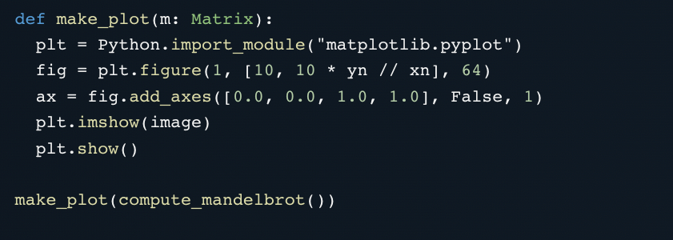

## Introducing Mojo — the new programming language for AI developers.  
介绍 Mojo — 面向 AI 开发人员的新编程语言。

5 min read 5 分钟阅读

5 days ago 5天前

Image created with [Midjourney](https://cdn.discordapp.com/attachments/1064599141335978075/1104108501954990180/Frank_Andrade_Baby_tortoise_turtle_on_a_skateboard_f3277304-6437-4eeb-8109-1eb72f238bb7.png)  
使用中途创建的映像

A new programming language for AI developers was just released: Mojo.  
一种面向AI开发人员的新编程语言刚刚发布：Mojo。

I know what you might be thinking — a new programming language to learn from scratch … Well, I have good news, Mojo is designed as a superset of Python, so if you already know Python learning Mojo shouldn’t be hard.  
我知道你可能在想什么——一种从头开始学习的新编程语言......好吧，我有个好消息，Mojo被设计为Python的超集，所以如果你已经知道Python学习Mojo应该不难。

But that’s not all. Mojo combines the usability of Python with the performance of C obtaining a speed that is up to 35000x faster than Python.  
但这还不是全部。Mojo将Python的可用性与C的性能相结合，获得了比Python快35000倍的速度。

If you’re into AI and already know Python, Mojo is definitely worth a try. Here’s everything you need to know about Mojo.  
如果你喜欢人工智能并且已经了解Python，那么Mojo绝对值得一试。以下是您需要了解的有关Mojo的所有信息。

## Why do we need Mojo if we already have Python?  
如果我们已经有了 Python，为什么我们需要 Mojo？

Python’s simplicity and versatility made it the language of choice in fields such as data science, machine learning, and AI. It has tons of packages that are very useful for anyone working with data, but for libraries that require great performance, Python only acts as a glue layer and low-level bindings to C, C++, and other languages with better performance.  
Python 的简单性和多功能性使其成为数据科学、机器学习和人工智能等领域的首选语言。它有大量的包，对于任何处理数据的人来说都非常有用，但对于需要出色性能的库，Python 仅充当粘合层和与 C、C++ 和其他性能更好的语言的低级绑定。

This enabled the development of libraries such as numpy and TensorFlow. However, this comes with a drawback: building these libraries is very complicated, it requires a low-level understanding of the internals of CPython, requires knowledge of C/C++, etc.  
这使得numpy和TensorFlow等库的开发成为可能。然而，这有一个缺点：构建这些库非常复杂，它需要对CPython的内部有低层次的理解，需要C/C++的知识，等等。

According to the Mojo [doc](https://docs.modular.com/mojo/why-mojo.html), the issues brought by Python go deeper and particularly impact the AI field.  
根据Mojo文档，Python带来的问题更深入，特别是影响AI领域。

Python alone isn’t able to address all the issues that applied AI systems need and that’s how Mojo was born. Mojo is a programming language that combines the usability of Python with the performance of C.  
仅靠Python无法解决应用AI系统所需的所有问题，这就是Mojo的诞生方式。Mojo是一种编程语言，结合了Python的可用性和C的性能。

The best of both worlds! 两全其美！

But Mojo isn’t a random project that emerged out of nowhere. In fact, Mojo comes from a company named Modular, co-founded by Chris Lattner, the same guy who created the Swift programming language and LLVM.  
但Mojo并不是一个凭空出现的随机项目。事实上，Mojo来自一家名为Modular的公司，由Chris Lattner共同创立，他是创建Swift编程语言和LLVM的同一个人。

That’s why I think this project is worth paying attention to. Now let’s see some of Mojo’s best features.  
这就是为什么我认为这个项目值得关注。现在让我们看看Mojo的一些最佳功能。

## Features of Mojo 魔术的特点

Mojo comes with many interesting features out of the box. Here are some of them.  
Mojo具有许多开箱即用的有趣功能。以下是其中的一些。

## 1\. Mojo is designed as a superset of Python  
1\. Mojo被设计为Python的超集

Mojo aims to be fully compatible with the Python ecosystem.  
Mojo的目标是与Python生态系统完全兼容。

This means that you could easily work with Mojo if you’re a Python programmer because both programming languages have many functions, features, and libraries in common.  
这意味着如果您是Python程序员，则可以轻松使用Mojo，因为这两种编程语言都具有许多共同的功能，特性和库。

Libraries such as numpy, pandas, and matplotlib are also available in Mojo. Here’s how you’d make a plot with matplotlib using Mojo.  
numpy，pandas和matplotlib等库也可以在Mojo中使用。以下是如何使用 Mojo 使用 matplotlib 制作绘图。

Screenshot: Mojo

That said, Mojo is still in a very [early stage](https://docs.modular.com/mojo/why-mojo.html), so it still misses many features of Python (for example it doesn’t support classes yet).  
也就是说，Mojo仍处于非常早期的阶段，因此它仍然缺少Python的许多功能（例如它尚不支持类）。

Hopefully, in future updates Mojo will be fully compatible with Python.  
希望在未来的更新中，Mojo将与Python完全兼容。

## 2\. Strong type checking 2.强型式检查

Mojo leverage types for better performance and error checking.  
Mojo 利用类型来提高性能和错误检查。

Screenshot: Mojo

Although you can still use flexible types like with Python, Mojo lets you use strict type-checking. This can make your code more predictable, manageable, and secure.  
虽然你仍然可以像Python一样使用灵活的类型，但Mojo允许你使用严格的类型检查。这可以使代码更可预测、更易于管理和安全。

## 3\. Memory ownership and borrowing checker  
3\. 内存所有权和借用检查器

Mojo supports a `owned` argument convention that is used for functions that want to take exclusive ownership over a value.  
Mojo 支持 `owned` 参数约定，该约定用于想要对值取得独占所有权的函数。

Screenshot: Mojo

This will help you take advantage of memory safety without the rough edges.  
这将帮助您利用内存安全性，而不会出现粗糙的边缘。

## 4\. Auto-tuning

Mojo has built-in autotuning that helps automatically find the best values for your parameters to take advantage of target hardware.  
Mojo具有内置的自动调整功能，可帮助自动找到参数的最佳值，以利用目标硬件。

Screenshot: Mojo

## 5\. Mojo leverages MLIR 5\. Mojo 利用 MLIR

By using the full power of Multi-Level Intermediate Representation (MLIR), Mojo developers can take advantage of vectors, threads, and AI hardware units.  
通过使用多级中间表示 （MLIR） 的全部功能，Mojo 开发人员可以利用向量、线程和 AI 硬件单元。

This helps Mojo achieve great performance because, unlike Python which works with single-threaded execution, Mojo can work with parallel processing across multiple cores.  
这有助于Mojo实现出色的性能，因为与使用单线程执行的Python不同，Mojo可以跨多个内核进行并行处理。

Screenshot: Mojo

That’s one of the reasons why Mojo it’s 35000x faster than Python.  
这就是为什么Mojo比Python快35000倍的原因之一。

Screenshot: Mojo

## How to start using Mojo 如何开始使用Mojo

Mojo is still a work in progress, but you can try it today on the JupyterHub-based Playground. To try Mojo go to this [website](https://www.modular.com/get-started) to register and don’t forget to check the Mojo box in the “Modular Product Interest” section.  
Mojo仍在进行中，但您今天可以在基于JupyterHub的Playground上尝试。要尝试Mojo，请访问此网站进行注册，不要忘记选中“模块化产品兴趣”部分中的Mojo框。

Happy coding!
