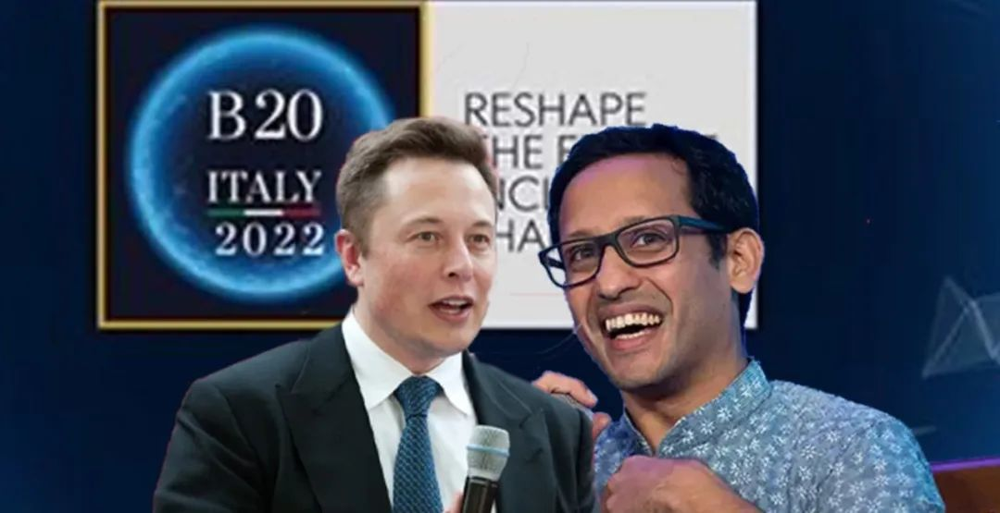

来源：微博  

2022年11月14日，在印尼巴厘岛举行的B20二十国集团工商界峰会上，埃隆·马斯克接受了企业家，印度尼西亚教育，文化，研究和技术部长纳迪姆·马卡里姆的远程采访。

在29分钟的视频访谈中，马斯克分享了他少年时阅读和观看大量的科幻和奇幻作品对他的影响，解释了第一性原理，谈了他关于教育，学习和年轻人职业发展建议的看法，并回答了三个观众提出的问题。这三个问题是关于成长中的失败和教训，公司和业务如何做大和培养日常的习惯的。

下面，是我摘抄的精华以及我的感受和评论。

**一、几乎所有时间都在工作**

主持人说有一件事情让人很困惑：你只有一个人，怎么能做这么多事？我们只是无法相信你做了这么多事。有没有什么秘诀？

马斯克回答说他确实投入了大量的时间。不过他不确定，他是否会向其他人推荐他的做法，因为他几乎所有时间都在工作，很少休息，哪怕是一个星期天。

看到这，“**比你优秀的人比你还努力**”这句话一下子跳入我的脑海。  

我的散打教练是一位英姿飒爽的前武警警花，她也是前国家散打队队员，拿过N次全国冠军。

她给我讲了一个故事，她有一个师兄，拿了全国各种散打比赛冠军的大满贯。这让她特别羡慕。

于是她问师兄是怎么做到的？师兄说他只是更刻苦而已。早晨规定6点开始训练，他5点就已经到达训练场地。1个小时之后，当别人才开始做热身的时候，他已经进入了最佳的训练状态。中午，队员们可以睡两个小时的午觉，可是他从来不睡，而是继续训练。他总觉得教练给安排的训练时间不够，他自己要补上。就这样日复一日，年复一年。他的进步也比其他人高了一大截。

没有什么彪悍的人生，只有一步一个脚印的成长。

**二、物理学是定律，其他一切都是建议**

马斯克说：“**任何人的意见都不重要，物理学是定律，其他一切都是建议**。

我见过很多人违反法律，但我从未见过有人违反物理学定律。

当然，你也可以挑战物理学定律，但它们已经被挑战得够够的，而且它们有很强的适应性。”

发现了吗，高手都善于抓住不确定性中的确定性，比如马斯克心心念的物理学第一性原理。有了这个，你的内心是笃定的，根基是稳固的。因为物理学定律是经过千锤百炼被验证过的原理。

**三、学习中建立相关性的重要性**

当你尝试学习一些东西时，极其重要的是，建立相关性，问问，你为什么要学这个？

因为我们的大脑一直在试图忘却。在潜意识层面上，我们的大脑试图决定，什么相关，什么不相关。

**你看到的大多数东西，你的大脑并不想记住它们，因为这样做没有意义。**

因此，你必须建立相关性。你想要说，这就是为什么你应该学习这个主题或那个主题。一旦你建立了相关性，你的大脑自然就会想要记住它。

有两种从根本上不同的方法开展教育，一种是通过对工具展开教学，另一种是通过你想解决一个问题，并尝试理解需要什么工具来解决问题。

这里我想展开三点：

**第一、为什么大脑不想记住看到的大多数东西？**

这是大脑的自我保护和协同机制，虽然大脑的重量只占人体重量的2%左右，但大脑消耗的能量却占全身消耗能量的20%，单位质量的代谢成本是肌肉的10倍。所以，大脑倾向于只记住那些有相关性的东西。在远古时代，这些东西就是那些能逃避危险，生存下来的东西。

**第二、关于问问为什么。**

实际情况是，有多少次，我们只是被动的接受，被动的教学，只知道“是什么”，甚至都没有想过要问“为什么”。这让我们在学习和工作的时候失去了方向。

**第三、带着问题去做事效率很高！**

因为你有了更具体和清晰的目的。比如，带着问题去读书，你大概率最终能找到一些答案。而不是书读完了，却不知道到底读了什么，解决了什么问题。

另外，谈到相关性，我想起了我学习英文单词常用的方法——造句子。如果只是机械地背诵一个有着复杂拼写、复杂词性和词义的单词，比如sophisticated，你很难记得住。但是，如果你把它放在句子里，想记住它就容易多了。比如，

Mr. Smith is a sophisticated world traveler.

史密斯先生是一位老练的环球旅行家。

This is a very sophisticated machine.

这是一台非常精密的机器。

Some sign languages are very sophisticated means of communication.

一些手势语是非常复杂的交流方式。

还有就是，几乎所有的记忆法都是建立在事物关联性基础上的。即，把一些看似杂乱无章，毫无关联的事物通过一种方式关联起来，以便记忆起来轻松、鲜活。

**四、年轻人的未来职业在哪里？**

我认为有一些事情很明显，任何与可持续能源有关的行业，在未来都将是非常重要的。如果与用于固定存储，或汽车、飞机、船只的锂电池相关，那将非常重要。

显然，**在所有领域，人工智能都将非常重要。**

当然，这些都是非常技术性的课题，还有许多其他值得追求的东西。但作为技术专家，这就是我的建议，人工智能和可持续技术。

我认为在合成生物学方面有很多的机会，围绕合成信使RNA。这将成为医药领域的一场革命。

我认为，类比于音频从模拟走向数字化，合成RNA，就是医药正在走向数字化。这是一场比大多数人所意识的更为深刻的革命。

但我是一名技术专家，有大量不涉及技术的好的选择。从技术的角度来看，我认为可持续能源，人工智能，合成生物学，可能是三大领域。

马斯克提到的“可持续能源，人工智能，合成生物学”正是当下被投资人热捧的，并且是工业4.0的一部分的三个行业。显然，他没有提到元宇宙（互联网）和加密货币。不知道是出于政治正确，还是他觉得这些行业的技术含量不够高。

**五、 永远假设，你在某种程度上是错误的**

来源：3dmgame

观众提问1：**你曾面临的最大障碍或错误是什么？你是如何克服的？**

埃隆·马斯克：好吧，坦率地说，我犯过很多错，把它们全部列出来要花太长的时间。我不想拿我过去犯过的超长的错误清单，让人们觉得厌烦。

但我认为，这里更高的原则是，随着时间的推移，总要渴望减少错误。要承认，你总会在某种程度上犯错，但你希望，随着时间的推移减少犯错。

如果你能每天少犯一点错误，我认为那就很棒。要每天少犯错，也是很难的。坦率地说，即使你在大多数日子里都能少犯错，这也是一个相当大的胜利。

我以前曾经公开说过，我认为，心智和思维都很重要，不能光看思维。我在雇用人员方面所犯过最大的错误之一，就是他们思维能力超强，但心智不足。两者都很重要，这很关键。

我认为，更高的原则是，**假设你是错的，而且你想少犯错，并且每天努力减少犯错。**

寻求批评性的反馈，特别是从朋友那里。通常，你的朋友会知道你说的是错的，但他们不想伤害你的感情，所以他们不会告诉你。但如果你要求他们告诉你，并说这不会伤害你的感情，那么他们就会告诉你。

我认为，**从朋友那里获取批评性的反馈，是非常有帮助的。**是的，希望这有帮助。

是的，我想说的是，我们永远都是错的。

你应该永远假设，你是错的，事实上，因为我们的确如此。

你想要采取「渴望减少犯错」的方法，而不是，「你是对的，让我们来证明你是对的」。选择认为你是错的，而且你希望能变得没那么错。

**首先，从心理学的角度来说，“假设自己是错的”是反人性的。**因为大多数都在倾尽一生，千方百计地证明自己的对的，哪怕我们心里知道有时候我们是错的。但是我们还是坚持自己是对的。

原因来自人类的生存本能：你是对的，你说的，做的才对别人有用，有价值。  

生物群体都是倾向于贬低、抛弃或驱逐对它没用的个体，所以个体都有一种“证明我有用”的压力。比如，迁徙的羊群不会等老残走不动的羊，狮群不会一直带着受伤的狮子，不然就会增加生存的难度。所以，不断“证明自己是对的”是因为害怕“被群体抛弃”而无法生存，所以你才会害怕被批评，渴望被认可。

**其次，马斯克提到的“在大多数日子里都能少犯错，这也是一个相当大的胜利”是一种防微杜渐的好习惯。**好习惯都是慢慢养成的，养成之后就有机会形成正向飞轮。反之，如果任由错误一再发生，当事人变得麻木不仁，就会形成心理上的“破窗效应”——已经有这么多虱子了，多一个也不嫌痒。

**六、关于习惯：执着的好奇心，可能是最重要的**

观众提问2：**有什么日常习惯，让你成为了现在的你？**

埃隆·马斯克：嗯，就日常习惯而言，我认为，对世界及世界的运作方式充满好奇，对技术好奇，对一切事物好奇。我认为，好奇心是一个非常重要的东西。

然后，要对好奇心有一定的执着。**执着的好奇心，可能是最重要的。**

而且，我认为冒险精神也很好。我认为，有时人们对某些事情感到害怕，而他们其实大可不必。你想要确保，你的恐惧与实际的危险相称

我认为，有时候，我们的本能恐惧与实际危险并不相称。因此，你想要尝试重新思考，比如试着说，好吧，这种恐惧是合理的吗？会不会真的有不好的事发生？

**你有时必须要审视一下你的本能恐惧，并质疑它**，并决定这是否是一种合理的恐惧。而往往它并不是，简单地审视一下恐惧，就会让它消失。

**首先，习惯太重要了！**一个好的习惯会让你事半功倍，一个不好的习惯则让你事倍功倍。这就差了4倍的时间！  

**其次，“保持好奇”才会让你有批判性思维**，凡事都想多问几个“为什么”，而不是随大流或者躺平。

**最后，关于恐惧和危险。**

在电影《重返地球》中，威尔史密斯对儿子说了这段话：

来源：spiritualcleansing.org

“Fear is not real. The only place that fear can exist is in our thoughts of the future. It is a product of our imagination, causing us to fear things that do not at present and may not ever exist. Do not misunderstand me, danger is very real, but fear is a choice.”

“恐惧不是真实的。恐惧唯一可以存在的地方是我们对未来的思考。它是我们想象力的产物，使我们害怕目前不存在，可能永远不存在的事物。不要误解我，危险是真实的，但恐惧是一种选择。”

如果你想经历变化，迎接挑战，首先，你要有“敢做精神Can-do spirit!”，战胜自己——选择不恐惧。同时，为可能的危险做好充分的准备。

来源 | 卢山说精进（ID：KEEP-POLISH）

作者 | 卢山 LUCENT LU；编辑 | 鱼丸养乐多

内容仅代表作者独立观点，不代表早读课立场

  

[.png")](https://mp.weixin.qq.com/s?__biz=MjM5NTQ5MjIyMA==&mid=2654576523&idx=1&sn=a4687f4b72dfa62a838f18d096ebdb7b&scene=21#wechat_redirect)
