

Small or large, it’s hard to keep track of tasks on a daily basis, especially when teams and businesses are often using a multitude of tools and methods through which you get assigned tasks.  
无论大小，都很难每天跟踪任务，尤其是当团队和企业经常使用多种工具和方法来获得分配的任务时。

Your boss might simply stop you in the hallway and ask you to do something, a colleague might send you a direct message, a client might send you an email. We can also lose sight of the important tasks and how best to go about prioritising that workload.  
你的老板可能会在走廊里拦住你，要求你做点什么，同事可能会给你发私信，客户可能会给你发电子邮件。我们也可能忽视重要的任务以及如何最好地确定工作量的优先级。

We get it, we’ve been there. Which is why we’ve curated this list of favourite task management tools of 2023.  
我们明白了，我们去过那里。这就是为什么我们策划了这份 2023 年最受欢迎的任务管理工具列表。

Remember, there’s no one size fits all. Check out each product to decide if you think it’s the right fit for yourself or your business.  
请记住，没有一种尺寸适合所有人。查看每种产品，以确定您认为它是否适合您自己或您的业务。

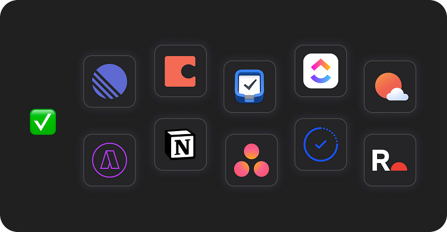

## The Tools ✅ 工具 ✅

[**Linear**](https://www.therepository.io/products/linear)

is a better way to build products.  
是构建产品的更好方法。

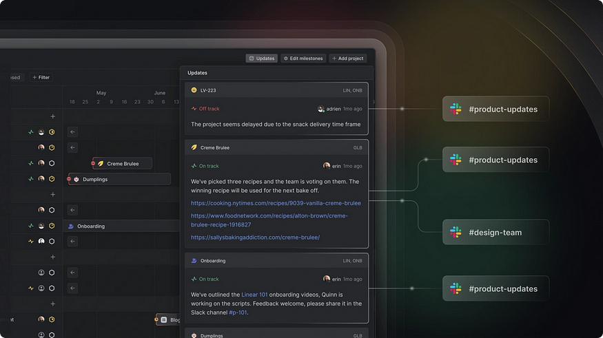

Meet the new standard for modern software development. Streamline issues, sprints, and product roadmaps. Create tasks in seconds, discuss issues in context, and breeze through your work in views tailored to you and your team.  
满足现代软件开发的新标准。简化问题、冲刺和产品路线图。在几秒钟内创建任务，在上下文中讨论问题，并在为您和您的团队量身定制的视图中轻松完成您的工作。

[**Taskable**](https://www.therepository.io/products/taskable)

for integrated tasks, calendar and timeblocking.  
用于集成任务、日历和时间块。

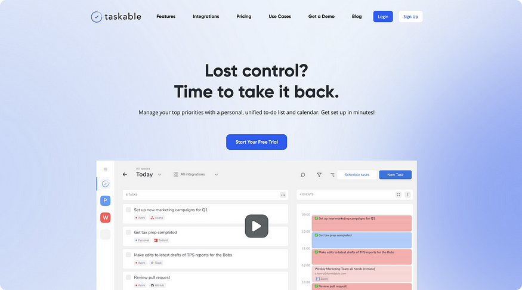

Lost control? Time to take it back. Manage your top priorities with a personal, unified to-do list and calendar. Take back control of your day. Join the thousands of other founders, freelancers, makers and many-hat wearers using Taskable to stay focused on their top priorities.  
失控？是时候收回它了。使用个人、统一的待办事项列表和日历管理您的首要任务。重新掌控您的一天。加入成千上万的其他创始人、自由职业者、制造商和戴多顶帽子的人，使用 Taskable 专注于他们的首要任务。

Taskable is a timeblocking and time management app for web and desktop. Taskable integrates with project managers, Gmail, Slack, and Google calendar to bring all the work you need to do into one place, schedule our your day or even week, and carve out time in your calendar for the work you need to do.  
Taskable是一款适用于Web和桌面的时间阻塞和时间管理应用程序。Taskable与项目经理，Gmail，Slack和Google日历集成，将您需要做的所有工作集中在一个地方，安排我们的一天甚至一周，并在日历中为您需要做的工作腾出时间。

[**Things**](https://www.therepository.io/products/things)

is the award-winning personal task manager that helps you achieve your goals.  
是屡获殊荣的个人任务管理器，可帮助您实现目标。

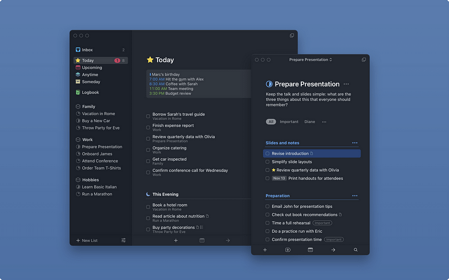

Things is the app for every thing you do. With it, you can organize every aspect of your life — from your daily routine to your long-term goals — and find the clarity that only comes from knowing what to do next.  
Things 是您所做的每件事的应用程序。有了它，你可以组织你生活的方方面面——从你的日常生活到你的长期目标——并找到只有知道下一步该做什么才能获得的清晰度。

[**ClickUp**](https://www.therepository.io/products/clickup)

is one app to replace them all.  
是一个应用程序来替换它们。

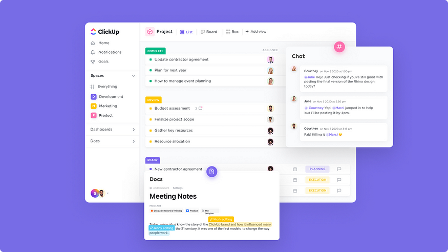

The next evolution of team productivity and collaboration is here. Unlock the next generation of productivity with the infinite possibilities of ClickUp. Tasks, Docs, Goals, Chat, and everything imaginable to make you more productive. ClickUp’s #1 rated productivity platform is making the world more productive with tasks, notes, projects, and time.  
团队生产力和协作的下一次演变就在这里。通过 ClickUp 的无限可能性释放下一代生产力。任务、文档、目标、聊天以及所有可以想象到的提高工作效率的内容。ClickUp 的 #1 评级生产力平台正在通过任务、笔记、项目和时间提高世界生产力。

[**Notion**](https://www.therepository.io/products/notion)

is a workspace that adapts to your needs.  
是一个适应您需求的工作空间。

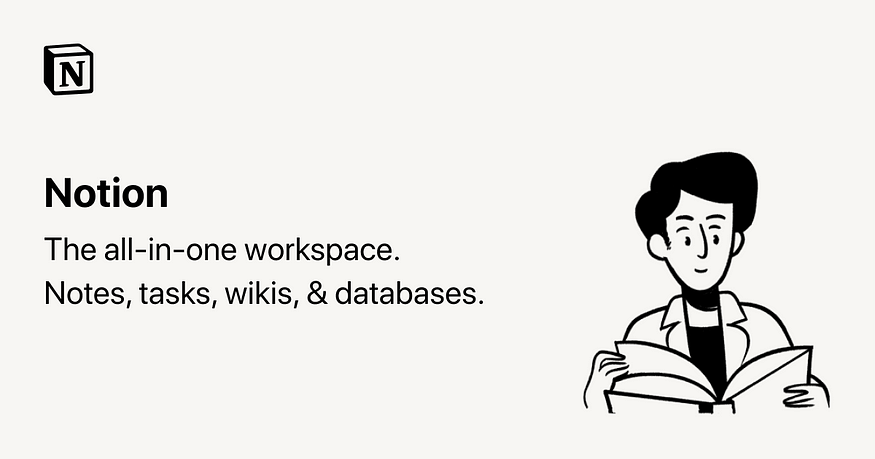

One workspace. Every team. Notion is more than a doc. Or a table. Notion is a single space where you can think, write, and plan. Capture thoughts, manage projects, or even run an entire company — and do it exactly the way you want.  
一个工作区。每个团队。概念不仅仅是一个文档。或者一张桌子。概念是一个单一的空间，您可以在其中思考、写作和计划。捕捉想法、管理项目，甚至运营整个公司 - 并完全按照您想要的方式进行。

[**Sunsama**](https://www.therepository.io/products/sunsama)

is the daily planner for busy professionals.  
是忙碌的专业人士的日常计划。

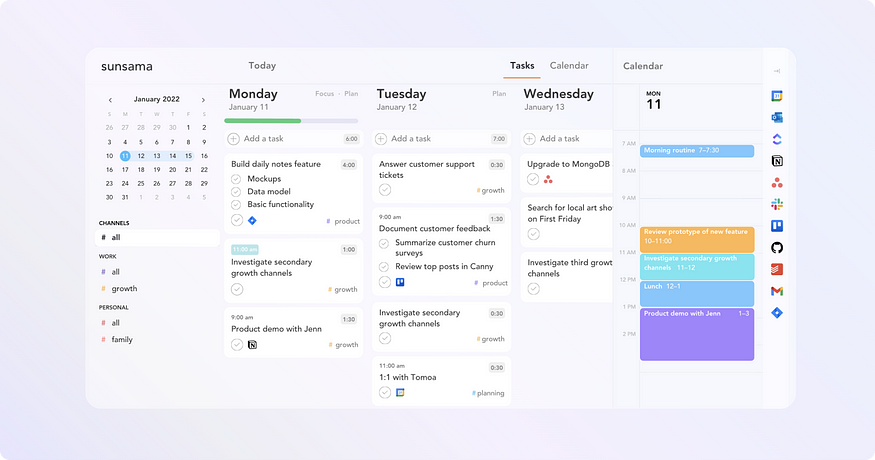

Sunsama organizes all your tasks, to-dos, and meetings day-by-day. Manage all the work you need to do today in one place.  
Sunsama 每天组织您的所有任务、待办事项和会议。在一个地方管理您今天需要做的所有工作。

[**Routine**](https://www.therepository.io/products/routine)

is tasks, notes and calendar in one blazingly fast productivity app for busy professionals.  
是任务，笔记和日历在一个超快的生产力应用程序中，适合忙碌的专业人士。

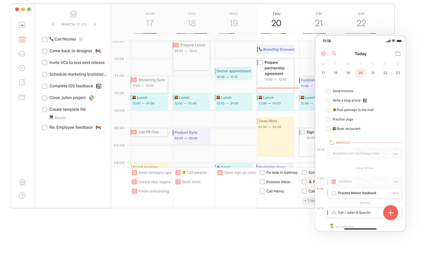

Unify your calendars, centralize your work, plan your days and focus on what matters now. Calendars, tasks & notes combined in a single app to collect, centralize, organize and act upon your personal and professional work.  
统一您的日历，集中您的工作，计划您的一天，并专注于现在重要的事情。日历，任务和笔记组合在一个应用程序中，以收集，集中，组织和处理您的个人和专业工作。

[**Coda**](https://www.therepository.io/products/coda)

is the evolution of docs. 是文档的演变。

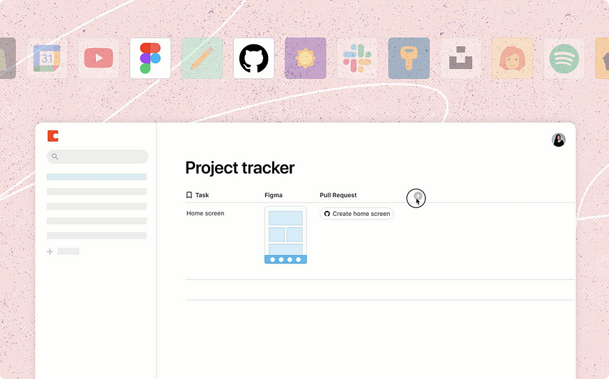

In a world full of applications, why do documents and spreadsheets still run the world? And why haven’t they been updated in over 50 years? Coda is a new kind of doc that brings words, data, and teams together. It comes with a set of building blocks that anyone can combine to create a doc as powerful as an app.  
在一个充满应用程序的世界里，为什么文档和电子表格仍然运行着世界？为什么它们在 50 多年里没有更新？Coda 是一种将文字、数据和团队结合在一起的新型文档。它带有一组构建块，任何人都可以组合这些构建块来创建与应用程序一样强大的文档。

[**Akiflow**](https://www.therepository.io/products/akiflow)

is the time blocking platform to save 2 hours every day.  
是每天节省2小时的时间阻塞平台。

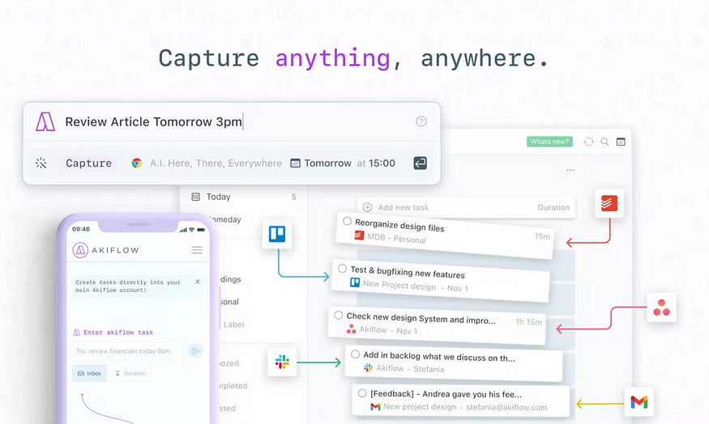

Consolidate all your tools in one place and block time for your tasks in your calendar.  
将所有工具整合到一个位置，并在日历中为您的任务留出时间。

[**Asana**](https://www.therepository.io/products/asana)

to easily connect people, processes, and cross-functional teamwork in one place.  
在一个地方轻松连接人员、流程和跨职能团队合作。

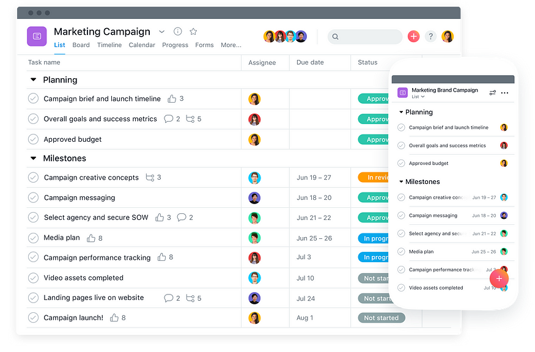

Asana helps teams orchestrate their work, from small projects to strategic initiatives. Headquartered in San Francisco, CA, Asana has more than 131,000+ paying customers and millions of free organizations across 190 countries.  
Asana帮助团队协调他们的工作，从小型项目到战略计划。Asana总部位于加利福尼亚州旧金山，在190个国家/地区拥有超过131，000 +付费客户和数百万个免费组织。

## The Repository

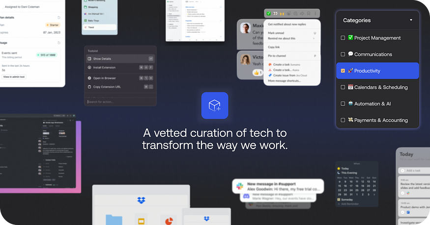

The Repository is a vetted curation of digital products and community for the next generation of business leaders and like-minded folk looking to share and learn about tech to transform the way we work.  
该存储库是经过审查的数字产品和社区策划，面向下一代商业领袖和志同道合的人，他们希望分享和学习技术以改变我们的工作方式。

[You can read more and explore The Repository here.  
您可以在此处阅读更多内容并探索存储库。](https://www.therepository.io/)
