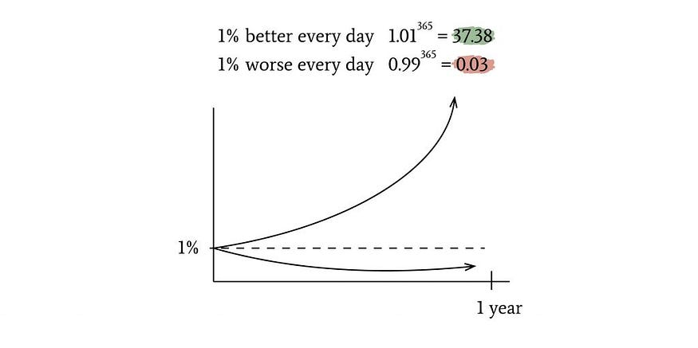

I could not have thought of a more obvious title but read till the end and you’ll know I mean it. Not because I am a philosophy expert but because this is something that I been preaching for the past 8 months and this head led me from making 0$ to 1000$  
我想不出一个更明显的标题，但读到最后，你就会知道我是认真的。不是因为我是哲学专家，而是因为这是我过去 8 个月一直在宣扬的东西，这个头让我从 0 美元到 1000 美元

You can search “How do I grow mentally?” or “How to become unrecognisable in months” but most of the times you’ll find generic answers.  
你可以搜索“我如何在精神上成长？”或“如何在几个月内变得无法辨认”，但大多数时候你会找到通用的答案。

-   Become more disciplined. 变得更加自律。
-   Make targeted goals and follow them  
    制定有针对性的目标并遵循它们
-   Go into a monk mode and give up desires  
    进入僧侣模式，放弃欲望
-   Wake up early, exercise and be focused  
    早起、锻炼和专注

Undoubtedly, these are things that you should follow. I don’t disregard this approach as this is in-fact helpful, but there is still something that is missing here.  
毫无疑问，这些是您应该遵循的事情。我不会忽视这种方法，因为这实际上是有帮助的，但这里仍然缺少一些东西。

> To get head of the 99% of the people, you’ll have to do what the 99% is unwilling to do  
> 要获得99%的人的头，你必须做99%的人不愿意做的事情

This is my motive and something that I tell myself everyday I wake up. 99% of the people I know are willing to party each weekend instead of learning to grow — so I do that. 99% of people are willing to take that job and do what is asked of them — so I go above and beyond to let people know I can do much more. 99% of people I know would rather give up on things than be uncomfortable in learning it.  
这是我的动机，也是我每天醒来都告诉自己的事情。我认识的99%的人都愿意每个周末参加聚会，而不是学习成长——所以我这样做了。99%的人愿意接受这份工作，做要求他们做的事情——所以我不遗余力地让人们知道我可以做得更多。我认识的99%的人宁愿放弃事情，也不愿在学习时感到不舒服。

If having goals and a good disciplined approach towards like is all it takes to be a millionaire, my househelp, my milkman, even my parents would have been a millionaire. Because all these mentioned people are diligent at their job, they wake up at the exact same time, save money, and have goals that they want to achieve.  
如果有目标和良好的纪律方法就可以成为百万富翁，我的家庭佣工，我的送奶工，甚至我的父母都会成为百万富翁。因为所有这些提到的人都在他们的工作中勤奋，所以他们在同一时间醒来，省钱，并有他们想要实现的目标。

If that skill is something that you can learn online or inculcate just by watching 10 min of sessions, then trust me, you’re replaceable; because millions of people can watch it, learn it and do it in the exact same manner as you can. Here are 7 things that you need to work on in order to become a better version of yourself:  
如果这项技能是您可以在线学习或仅通过观看 10 分钟的课程来灌输的，那么相信我，你是可以替代的;因为数以百万计的人可以观看它，学习它并以与您完全相同的方式进行操作。以下是您需要努力的 7 件事，以便成为更好的自己：

1.  **Focus on what matters 专注于重要的事情**

The emphasis is not on ‘Focus’ but on ‘What matters’. Look around your place and see what matters to you most. People will tell you to read read read but if you like podcasts or gain knowledge better by listening then do so. If you prefer yoga instead of exercising, do so. Don’t waste your energy on things that you are not comfortable doing. Life is too short for doing things that you’re not excited about. Social media, celebrity gossip, or material possessions — all are energy drainers. This means taking a hard look at our priorities and making sure we’re investing our time and energy in the things that truly matter to us.  
重点不在于“专注”，而在于“重要的事情”。环顾你的位置，看看什么对你来说最重要。人们会告诉你阅读，但如果你喜欢播客或通过听来更好地获得知识，那就这样做吧。如果您更喜欢瑜伽而不是锻炼，请这样做。不要把精力浪费在你不舒服的事情上。生命太短暂，无法做你不兴奋的事情。社交媒体、名人八卦或物质财富——都是能源消耗者。这意味着要认真审视我们的优先事项，并确保我们将时间和精力投入到对我们真正重要的事情上。

**2\. Embrace discomfort 2\. 拥抱不适**

Growth and discomfort go hand in hand. To get successful you’ll have to do something that most people are unwilling to do. Take bigger risks or even step outside the societal expectation. If you want to grow mentally, you need to be willing to face our fears, take risks, and embrace uncertainty. This means getting comfortable with discomfort, rather than trying to avoid it at all costs. When you embrace discomfort, you open ourselves up to new opportunities and experiences, and become more resilient and adaptable in the face of challenges.  
生长和不适是相辅相成的。为了获得成功，你必须做一些大多数人不愿意做的事情。承担更大的风险，甚至超越社会期望。如果你想在精神上成长，你需要愿意面对我们的恐惧，承担风险，拥抱不确定性。这意味着要适应不适，而不是不惜一切代价试图避免不适。当你拥抱不适时，你就会敞开心扉接受新的机会和经验，并在面对挑战时变得更有弹性和适应性。

**3\. Take responsibility for your life  
3\. 对自己的生活负责**

I know you’ve been through stuff in your life, and that trauma is not easy to forget. Trust me I know, I’ve gone through a lot of shit and in some ways am even going through. That kind of stuff never leaves you, there are days when I am sad about it but you know what — I will never let it stop me again.  
我知道你一生中经历过一些事情，这种创伤不容易忘记。相信我，我知道，我经历过很多狗屎，在某些方面甚至正在经历。这种东西永远不会离开你，有些日子我会为此感到难过，但你知道吗——我再也不会让它阻止我了。

Take responsibility for your lives, rather than blaming others or external circumstances for problems. When we take responsibility, you become empowered to make positive changes and pursue goals with purpose and intention. This means acknowledging your flaws and mistakes, and being willing to learn from them rather than making excuses.  
对自己的生活负责，而不是将问题归咎于他人或外部环境。当我们承担责任时，您就有能力做出积极的改变，并有目的和意图地追求目标。这意味着承认自己的缺点和错误，并愿意从中吸取教训，而不是找借口。

**4\. Let go of the need for approval  
4\. 放弃审批的需要**

One of the biggest obstacles to personal growth is your need for validation. When you base our self-worth on external factors, you become trapped in a never-ending cycle of seeking approval and avoiding criticism. There are business ideas that people never liked but people stiff went ahead with, why? Because they have faith in the idea.  
个人成长的最大障碍之一是你需要验证。当你把我们的自我价值建立在外部因素上时，你就陷入了一个永无止境的寻求认可和避免批评的循环中。有些商业理念人们从来不喜欢，但人们僵硬地继续前进，为什么？因为他们对这个想法有信心。

To get ahead of 99% of people, you need to let go of this need for approval and focus on developing a sense of internal validation. This means accepting yourself for who you are, flaws and all, and being willing to take risks and pursue your goals even if others disapprove.  
为了领先于99%的人，你需要放弃这种对批准的需求，专注于培养一种内部认可感。这意味着接受你自己是谁，缺点和一切，并愿意冒险并追求自己的目标，即使别人不赞成。

**5\. Develop resilience 5\. 培养韧性**

Resilience is key to personal growth and success. Resilience is the ability to bounce back from setbacks, adapt to changing circumstances, and keep moving forward in the face of adversity. To develop resilience, you need to embrace discomfort, take risks, and learn from your failures. You also need to develop a sense of perspective, recognising that setbacks and failures are a natural part of the growth process.  
韧性是个人成长和成功的关键。韧性是从挫折中恢复过来，适应不断变化的环境，并在逆境中继续前进的能力。为了培养韧性，你需要接受不适，承担风险，并从失败中吸取教训。你还需要培养一种视角感，认识到挫折和失败是成长过程中自然的一部分。

**6\. Embrace the journey 6\. 拥抱旅程**

Finding meaning in life is not achieving specific goals or milestones, but rather embracing the journey itself. This means finding joy in the process of growth and self-discovery, rather than focusing solely on the destination. You need to cultivate a sense of curiosity and wonder about the world, and approach each day with a sense of adventure and possibility. Most people become unhappy in their mid twenties because they feel aimless. From a young age our purposes and gaols were defined for you  
寻找人生的意义不是实现特定的目标或里程碑，而是拥抱旅程本身。这意味着在成长和自我发现的过程中找到快乐，而不是只关注目的地。你需要培养对世界的好奇心和好奇心，并以冒险和可能性的态度对待每一天。大多数人在二十多岁时变得不快乐，因为他们觉得漫无目的。从很小的时候起，我们就为您定义了我们的目的和监狱

-   Go through school 通过学校
-   Get good grades 取得好成绩
-   Get into a good college 进入一所好大学
-   Get a degree 获得学位
-   Get a job 找工作

By your mid twenties you are probably done with this cycle and then you are confused because you cannot think for yourself anymore. You have no one to tell you what to do and you think the rest of your life is doing that job and aiming for promotions. You need to embrace that life is all about learning and finding new things. Don’t let a set of rules decide what you can do with your life.  
到你二十多岁的时候，你可能已经完成了这个循环，然后你感到困惑，因为你不能再为自己思考了。你没有人告诉你该做什么，你认为你的余生都在做这份工作，争取晋升。你需要接受生活就是学习和发现新事物。不要让一套规则决定你的生活可以做什么。

**7\. Cultivate meaningful relationships  
7\. 培养有意义的关系**

Finally, cultivating meaningful relationships is so important for growth and happiness. Strong relationships provide us with a sense of connection, support, and belonging, and help us to navigate the challenges of life. Also, it is said you are the sum total of all the people you hand out with. Once you surround yourself with people who believe in you, challenge your knowledge and help you explore your true potential, you’re more likely to grow faster.  
最后，培养有意义的关系对于成长和幸福非常重要。牢固的关系为我们提供了联系、支持和归属感，并帮助我们应对生活中的挑战。此外，据说您是与您分发的所有人的总和。一旦你周围都是相信你的人，挑战你的知识并帮助你发掘你的真正潜力，你就更有可能成长得更快。

Be willing to invest time and energy in building and maintaining connections with others, and to be open and vulnerable in our interactions.  
愿意投入时间和精力与他人建立和维持联系，并在我们的互动中保持开放和脆弱。

In conclusion, getting ahead of 99% of people and growing mentally does not necessarily require you to be a monk or even follow a very monotonous lifestyle, it requires a shift in mindset and approach. By focusing on what really matters, embracing discomfort, taking responsibility of our lives.  
总之，领先于99%的人并在精神上成长并不一定需要你成为一名僧侣，甚至不需要你遵循非常单调的生活方式，它需要思维方式和方法的转变。通过专注于真正重要的事情，拥抱不适，对我们的生活负责。

Thank you for reading my content. I create **notion template for developers, students and productivity fanatics**. I also give growth and Notion dashboard creation consultancies! Get to know about each new blog by subscribing to emails!  
感谢您阅读我的内容。我为开发人员，学生和生产力狂热者创建概念模板。我还提供增长和概念仪表板创建咨询！通过订阅电子邮件了解每个新博客！

Check out my templates at: [Gumroad](https://moulshree.gumroad.com/)  
查看我的模板： 口香糖路  
Twitter: [itsmoul](https://twitter.com/itsmoul) 推特：itsmoul  
Product Hunt: [Smoul](https://www.producthunt.com/@moulshree_211) 产品搜寻：斯莫尔
