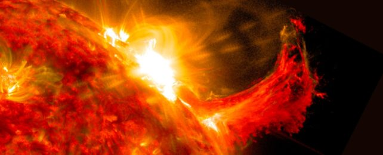

 A solar flare and a burst of solar material erupting out into space. [(NASA/SDO)](https://www.nasa.gov/feature/goddard/2023/sun/nasa-enabled-ai-predictions-may-give-time-to-prepare-for-solar-storms)  
太阳耀斑和太阳物质爆发到太空中。 （美国宇航局/SDO）

We've touched on the hazards of [solar storms](https://www.sciencealert.com/geomagnetic-storms) plenty of times in the past. We've also recently started reporting even more stories involving some sort of AI, especially in the last few months since it has come back to the forefront of many discussions around technologies.  
我们过去曾多次谈到太阳风暴的危害。我们最近也开始报道更多涉及某种人工智能的故事，特别是在过去的几个月里，它已经回到了许多关于技术的讨论的最前沿。

So it should come as no surprise that a team at [NASA](https://www.nasa.gov/feature/goddard/2023/sun/nasa-enabled-ai-predictions-may-give-time-to-prepare-for-solar-storms) has been busily applying AI models to [solar storm](https://www.sciencealert.com/geomagnetic-storms) data to develop an early warning system that they think could give the planet about 30 minutes' notice before a potentially devastating solar storm hits a particular area.  
因此，美国宇航局的一个团队一直在忙于将人工智能模型应用于太阳风暴数据，以开发一种预警系统，他们认为该系统可以在潜在破坏性的太阳风暴袭击特定区域之前提前约30分钟通知地球，这并不奇怪。

That lead time is thanks to the fact that light (i.e., what radio signals are made out of) can travel faster than the solar material ejected out of the Sun in the event of these solar storms. In some events, such as one that impacted Quebec around 35 years ago, they can shut off power for hours.  
这个提前期要归功于这样一个事实，即在这些太阳风暴中，光（即无线电信号是由什么组成的）可以比太阳物质从太阳喷射出来的太阳物质传播得更快。在某些情况下，例如大约35年前影响魁北克的事件，他们可以关闭电源数小时。

More extreme events, such as the Carrington event that happened more than 150 years ago, can cause massive destruction of electrical and communication infrastructure if they were to happen today.  
更极端的事件，例如150多年前发生的卡林顿事件，如果今天发生，可能会对电力和通信基础设施造成大规模破坏。

Scientists have long been aware of the problem and haven't sat idly by. At this point in our species' exploration of the Solar System, plenty of satellites are looking at the Sun that can be used to identify these solar outbursts.  
科学家们早就意识到了这个问题，并没有袖手旁观。在我们物种探索太阳系的这一点上，许多卫星正在观察太阳，可以用来识别这些太阳爆发。

<iframe src="https://www.youtube.com/embed/5xPBonKpHIM?feature=oembed" frameborder="0" allowfullscreen="" data-immersive-translate-effect="1" data-immersive-translate-block-mark="1" data-immersive-translate-mark="1"> frameborder="0″ allow="accelerometer; autoplay; clipboard-write; encrypted-media; gyroscope; picture-in-picture; web-share" allowfullscreen&gt; 帧边框=“0” 允许=“加速度计;自动播放;剪贴板写入;加密媒体;陀螺仪;画中画;网络共享“允许全屏&gt;</iframe>

Some of those satellites include ACE, Wind, IMP-8, and Geotail, which supplied data to the NASA team. But, as any AI researcher can tell you, in order to develop a predictive model, you have to tell it what it is meant to predict.  
其中一些卫星包括ACE，Wind，IMP-8和Geotail，它们为NASA团队提供了数据。但是，正如任何人工智能研究人员都可以告诉你的那样，为了开发一个预测模型，你必须告诉它它要预测什么。

Knowing simply that a solar storm is on its way is only one part of the battle – you also have to know what kind of impact it will have on the Earth when it hits there. So the researchers also collected data from surface-based stations that were also affected by some storms that the satellites detected.  
仅仅知道太阳风暴即将来临只是战斗的一部分——你还必须知道当它袭击地球时会对地球产生什么样的影响。因此，研究人员还从地面站收集数据，这些站也受到卫星探测到的一些风暴的影响。

The scientists then set about training a deep learning model, which has recently become almost a household word. In this case, they named it [DAGGER](https://doi.org/10.1029/2022SW003045), and it has some pretty impressive specifications compared to existing predictive algorithms that have attempted to do the same thing.  
然后，科学家们开始训练深度学习模型，该模型最近几乎成为家喻户晓的词。在这种情况下，他们将其命名为 匕首 ，与尝试做同样事情的现有预测算法相比，它具有一些令人印象深刻的规格。

Most notable is its increase in speed. The researchers, led by Vishal Upendran from the Inter-University Center for Astronomy and Astrophysics in India, claim that the algorithm can predict the severity and direction of a solar storm event in under a second and that it is capable of making a prediction every minute.  
最值得注意的是它的速度提高。由印度大学间天文学和天体物理学中心的Vishal Upendran领导的研究人员声称，该算法可以在一秒钟内预测太阳风暴事件的严重程度和方向，并且能够每分钟进行预测。

Previous attempts by earlier algorithms would take orders of magnitude longer – almost to the point where they would give hardly any warning time before a storm hit the Earth.  
早期算法以前的尝试需要更长的时间几个数量级 - 几乎到了在风暴袭击地球之前几乎不会给出任何警告时间的程度。

Part of that struggle with timeliness was because it was computationally challenging to calculate where a storm might hit anywhere on the globe. That is another step forward for DAGGER, which can perform its quick prediction logic for the entire Earth's surface area.  
与及时性的斗争部分原因是，计算风暴可能袭击全球任何地方的位置在计算上具有挑战性。这是DAGGER向前迈出的又一步，它可以对整个地球表面积执行快速预测逻辑。

Making such predictions locally is extremely important – at any point in time when a solar storm might hit the Earth, half of the globe will be protected by the planet's entire bulk – in a state of what we commonly refer to as "night".  
在当地做出这样的预测非常重要 - 在太阳风暴可能袭击地球的任何时候，地球的一半都将受到地球整体的保护 - 处于我们通常所说的“夜晚”状态。

This combined speed of prediction with the ability to apply those predictions to an entire globe makes DAGGER a considerable step forward in predicting and accurately responding to potential hazards from solar storms. And it is launching on an open source platform just in time to collect plenty of data as the Sun ramps up to the peak of its 11-year solar cycle in 2025.  
这种预测速度与将这些预测应用于整个地球的能力相结合，使DAGGER在预测和准确应对太阳风暴的潜在危害方面向前迈出了相当大的一步。它正在一个开源平台上推出，正好在2025年太阳上升到其11年太阳周期的顶峰时收集大量数据。

That gives utility and communication companies a few years to integrate DAGGER into their threat assessment systems before the most severe weather comes.  
这使公用事业和通信公司有几年的时间在最恶劣的天气到来之前将DAGGER集成到他们的威胁评估系统中。

While there might not be any wailing sirens similar to the tornado warning sirens, that we have here in the Midwest of the US, at least the right people will be made aware of the danger faster than they would have been before.  
虽然可能没有任何类似于龙卷风警告警报器的哀号警报器，但我们在美国中西部有，但至少正确的人会比以前更快地意识到危险。

**This article was originally published by [Universe Today](https://www.universetoday.com/). Read the [original article](https://www.universetoday.com/161355/nasa-thinks-they-can-give-us-30-minutes-of-warning-before-a-killer-solar-storm-hits-earth/).  
本文最初由《今日宇宙》发表。阅读原文。**
