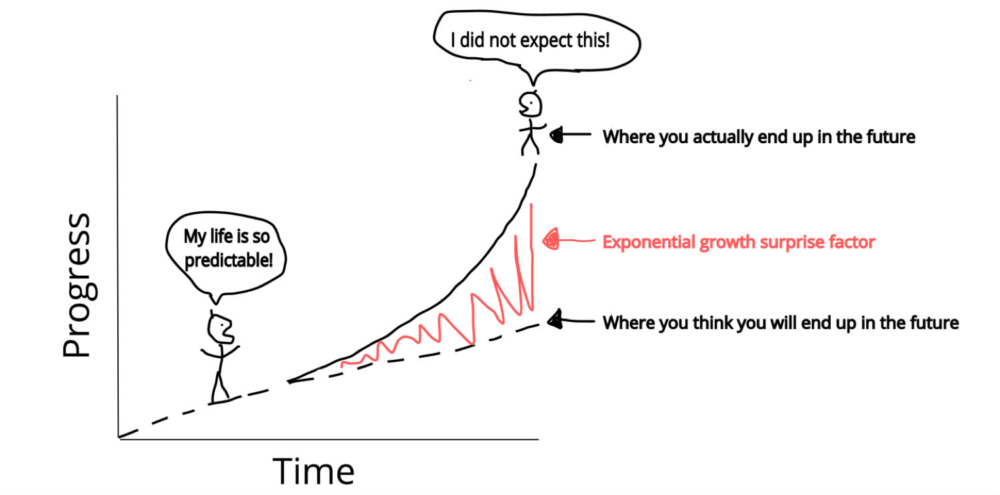
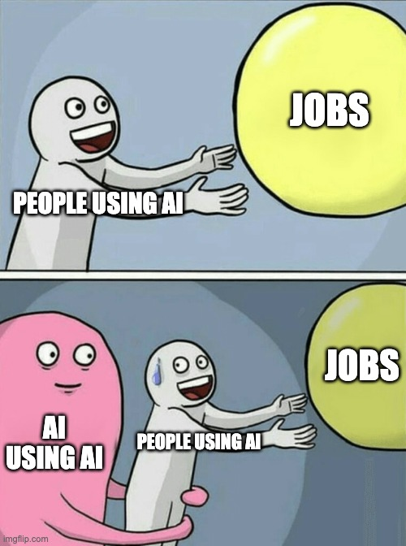

Like most people in tech, I have been bombarded lately with a ton of _“AI stuff”_. Articles upon articles of opinions and rants. Papers and videos on various subjects from technical architectures to societal impacts and beyond.  
像大多数科技界人士一样，我最近被大量的“人工智能”轰炸。文章一篇又一篇的观点和咆哮。关于从技术架构到社会影响等各种主题的论文和视频。

While one must preserve a level-headed view on all these subjects and opinions, two related topics make me sad and annoyed at the same time. Namely:  
虽然人们必须对所有这些主题和观点保持冷静的观点，但两个相关的话题同时让我感到悲伤和恼火。即：

-   AI won’t replace people. People using AI will replace people, and,  
    人工智能不会取代人。使用人工智能的人将取代人，而且，
-   Prompt engineering is the future. Everyone should learn it to be competitive.  
    快速工程是未来。每个人都应该学习它以保持竞争力。

So let’s explore these two topics in a bit of detail.  
因此，让我们详细探讨这两个主题。

## People using AI will replace people not using AI  
使用人工智能的人将取代不使用人工智能的人

I believe there are a few reasons why this topic keeps re-appearing in all discussion threads. The most likely one though is _“forced optimism”_. It is hard to believe that people don’t feel anxious about these massive shifts – after all, it’s human nature to feel anxiety towards change (of any kind). It becomes easier to tell oneself _“I will adapt, it will be good for me. I have control.”_ We, humans, tend to overestimate how much control we have in any given situation, and this is a perfect example.  
我相信这个话题不断出现在所有讨论线程中有几个原因。不过，最有可能的是“被迫乐观”。很难相信人们不会对这些巨大的变化感到焦虑——毕竟，对变化（任何形式的）感到焦虑是人类的天性。更容易告诉自己“我会适应，这对我有好处。我有控制权。我们人类倾向于高估我们在任何特定情况下的控制力，这是一个很好的例子。

On the other hand, there is a clear underestimation of the force and speed of the changes. There have been numerous charts regarding exponential growth and linear thinking, but here’s a reminder (courtesy of [Singularity Hub](https://singularityhub.com/2016/04/05/how-to-think-exponentially-and-better-predict-the-future/)):  
另一方面，人们明显低估了变化的力量和速度。有许多关于指数增长和线性思维的图表，但这里有一个提醒（由Singularity Hub提供）：

I think most people are betting that _“next ChatGPT”_ will only be a **bit better** than the current version, and not **much better**. At this moment I cannot say which way things will go, but I will bet myself that it’s going to be **much better**.  
我认为大多数人都在打赌“下一个 ChatGPT”只会比当前版本好一点，并没有好多少。目前我不能说事情会走向何方，但我敢打赌，事情会好得多。

And finally, I will make a somewhat objectionable comparison of this phrase to **victim blaming**. If you lost your job, is not because there’s no need for your services anymore, but rather - **it’s your fault, you could not keep up**. This is a very dangerous mode of thinking that I think does a great disservice to everyone, including the people propagating this nonsense. You should know better!  
最后，我将把这句话与受害者指责进行比较，有点令人反感。如果你失去了工作，不是因为不再需要你的服务，而是 - 这是你的错，你跟不上。这是一种非常危险的思维模式，我认为对每个人都有很大的伤害，包括传播这种胡说八道的人。你应该更清楚！

So how do we put all these things together and what can we say about this line of reasoning? Well, if you’ve been reading up until this point you already know what I am going to say: **“No, AI will replace your job. Not people using AI.”**. For jobs that don’t require humans for liability purposes (e.g. doctors, lawyers, licensed engineers) there’s hard to see how _one using AI_ is better than simply _AI_.  
那么我们如何把所有这些东西放在一起，我们能对这种推理说些什么呢？好吧，如果你一直阅读到这一点，你已经知道我要说什么：“不，人工智能将取代你的工作。不是使用人工智能的人。对于不需要人类承担责任的工作（例如医生、律师、有执照的工程师），很难看出使用人工智能比简单的人工智能更好。

I must reiterate that I am not interested in the very short-term future (1 to 2 years). It is not relevant. One cannot buy a house, save money or grow a family in 1 to 2 years. **Go ahead, use AI to help you stay afloat for a couple of years.** It won’t matter after that, when **YOU** are the slowest component of the chain and replacing **YOU** will improve the productivity of the entire process.  
我必须重申，我对短期的未来（1至2年）不感兴趣。这无关紧要。一个人无法在 1 到 2 年内买房、存钱或组建家庭。来吧，使用人工智能来帮助你维持几年的生计。在那之后就没关系了，当你是链条中最慢的组成部分时，更换你将提高整个过程的生产力。

Here’s an obligatory meme that I find best relays the message:  
这是一个强制性的模因，我发现它最好地传达信息：

## Prompt engineering is the future 快速工程是未来

This is the most misguided thing I have seen in a long time and I wish people would be more careful about taking this seriously. I want to explore a bit the absurdity of the following statement (seen on LinkedIn):  
这是我在很长一段时间内看到的最误导的事情，我希望人们能更加小心地认真对待这件事。我想探讨一下以下陈述的荒谬性（见LinkedIn）：

> Prompt Engineering: one of the hottest🔥 and most rewarding🤑 fields in tech  
> 提示工程：技术领域最热门、最🔥有价值的🤑领域之一

My response to the original poster was that it is **not** engineering and it’s **not** a field in tech. And don’t get me started with the _rewarding_ part.  
我对原始海报的回应是，它不是工程学，也不是技术领域。不要让我从有益的部分开始。

So why isn’t it engineering? Well, is asking a question _“engineering”_? Excuse me for being pedantic but from what I’ve learned it’s part of the field of _“philosophy”_. There is no engineering involved. And even if there is _“skill”_ required to formulate a well-structured question for the LLM, that is not an engineering pursuit.  
那么为什么它不是工程呢？那么，问一个问题是“工程”吗？请原谅我迂腐，但据我所知，这是“哲学”领域的一部分。不涉及工程。即使需要“技能”来为LLM制定一个结构良好的问题，那也不是工程追求。

Now, I don’t want to linger on technicalities over the naming of this process. What interests me instead is the amount of knowledge required to formulate these questions and I would guess it’s **very little**. You see, calling it _“engineering”_ creates wrong expectations. One can argue that it tries to convince people that it’s a **marketable skill** - a skill that they can use for employment security, and, in some cases give an advantage.  
现在，我不想在这个过程的命名上徘徊在技术细节上。相反，我感兴趣的是提出这些问题所需的知识量，我猜这很少。你看，称其为“工程”会产生错误的期望。有人可能会争辩说，它试图说服人们这是一种适销对路的技能——一种他们可以用于就业保障的技能，并且在某些情况下会产生优势。

On a related note, the type of questions one asks are intimately tied to the architecture of the underlying model one uses. The alignment process used by each model provider is different and changes over time to make it better at understanding even the vaguest of questions. So this purported _“skill”_ is nothing but a temporary adjustment in how one asks questions - a process that is bound to change often.  
与此相关的是，人们提出的问题类型与所使用的底层模型的架构密切相关。每个模型提供程序使用的对齐过程都是不同的，并且会随着时间的推移而变化，以便更好地理解甚至模糊的问题。因此，这种所谓的“技能”只不过是人们提问方式的暂时调整——这个过程注定会经常变化。

My advice to people is this: do not take these _“skills”_ too seriously. I know these are uncertain times and things are changing fast. One needs to be very careful not to be left behind. But this time, it’s out of your control. One cannot do much to stay relevant and these _“new skills”_ that are being sold to you are just **red herrings**.  
我对人们的建议是：不要把这些“技能”看得太重。我知道这是不确定的时期，事情变化很快。一个人需要非常小心，不要被抛在后面。但这一次，它超出了你的控制。一个人无法做太多事情来保持相关性，这些卖给你的“新技能”只是红鲱鱼。
