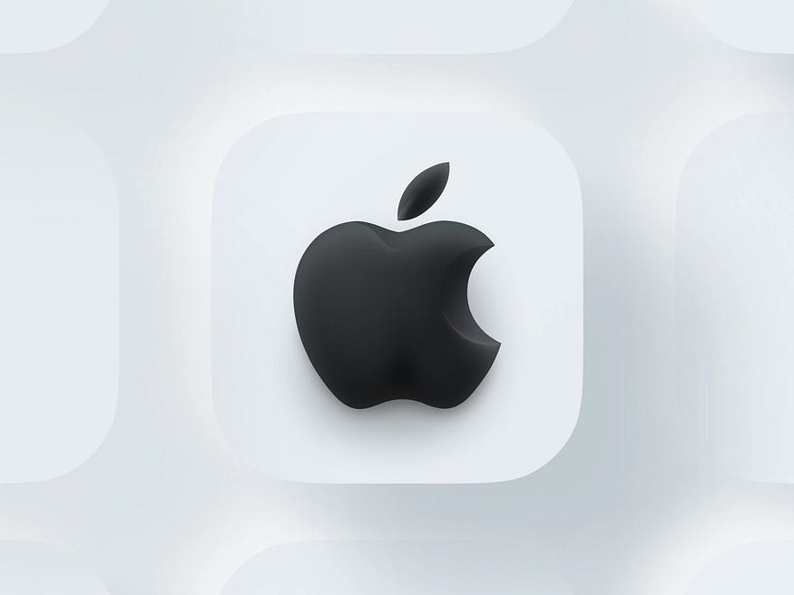

Dec 31, 2022 12月 31， 2022

In 2021 I landed my dream job. Working at Apple, the holy grail of minimalistic design, innovation and creativity. A place where misfits have a seat on the table and where bold, crazy ideas are highly encouraged. As a Product Designer, working at Apple was a life changing experience, and all I can say is that I’ll keep carrying some of its principles with me wherever I go. In the one year that I worked at Apple, here are the top 10 lessons I learned:  
2021 年，我找到了我梦寐以求的工作。在 Apple 工作，是极简主义设计、创新和创造力的圣杯。一个不合群的人在桌子上占有一席之地，一个强烈鼓励大胆、疯狂的想法的地方。作为一名产品设计师，在苹果工作是一次改变人生的经历，我只能说，无论我走到哪里，我都会继续随身携带它的一些原则。在我在苹果工作的一年里，以下是我学到的10大教训：

## Need help preparing for a job interview? I have time slots available and would love to give you expert guidance and support! Reach out to me ☞ [apach.work/mentorings](https://www.apach.work/mentorings)  
需要帮助准备工作面试吗？我有可用的时间段，很乐意为您提供专家指导和支持！apach.work/mentorings 联系我 ☞

**TL;DR**

-   Apple is a unique company and I believe that the way they do product design can only be successful due to their business model, which allows for innovation, failure, risks, and strong focus on design craft excellence, even if it takes a long time to get there.  
    苹果是一家独特的公司，我相信他们做产品设计的方式只能成功，因为他们的商业模式允许创新、失败、风险，并强烈关注卓越的设计工艺，即使需要很长时间才能到达那里。
-   Build a great product, not an MVP.  
    构建一个伟大的产品，而不是一个MVP。
-   Storytelling is the best skill we need to develop as product designers.  
    讲故事是我们作为产品设计师需要发展的最佳技能。
-   A top-down culture is not as bad as we think.  
    自上而下的文化并不像我们想象的那么糟糕。

_Disclaimer: The opinions presented here are all based on my experience and don’t necessarily reflect how Apple operates.  
免责声明：这里提出的观点都是基于我的经验，并不一定反映苹果的运作方式。_

## Great design will take you far, great communication will take you even further: influence people and move things forward.  
伟大的设计会带你走得更远，伟大的沟通会带你走得更远：影响人们并推动事情向前发展。

Projects get built when enough people believe in them. From small talks to elaborating decisions to VP presentations. The way we speak, project ourselves and elaborate our thoughts is fundamental for getting consensus, influencing people, and moving things forward.  
当有足够多的人相信它们时，项目就会建立起来。从闲聊到详细决策再到副总裁演示。我们说话、投射自己和阐述想法的方式对于达成共识、影响人们和推动事情向前发展至关重要。

My biggest learning was to put passion into my speech. Not only when presenting work, but e_specially_ when talking in meetings. Be truly excited about your work and show this excitement to everyone working around you.  
我最大的收获是把激情投入到我的演讲中。不仅在介绍工作时，尤其是在会议中发言时。对你的工作感到真正的兴奋，并向你周围的每个人展示这种兴奋。

Jobs had an amazing ability to make his ideas understandable and memorable because he spoke with passion. People may not remember what you said, but they will remember how _you made them feel_: confident, interested, optimistic, bored, reluctant, etc.  
乔布斯有一种惊人的能力，使他的想法易于理解和难忘，因为他说话充满激情。人们可能不记得你说了什么，但他们会记得你给他们的感觉：自信、感兴趣、乐观、无聊、不情愿等。

At the end of the day, we’re not only selling products to customers externally, but also selling our ideas to teams and stakeholders internally, and the key to any successful sale is communication.  
归根结底，我们不仅向外部客户销售产品，而且还向内部的团队和利益相关者销售我们的想法，任何成功销售的关键是沟通。

## Storytelling is your superpower: are we deck designers after all?  
讲故事是你的超能力：我们毕竟是甲板设计师吗？

One of the things that surprised me the most was to see that for _any_ piece of work being shared, designers would put together a keynote deck for it. It could be the smallest thing, like a quick look at the latest work progression, or big presentations, of course. At Apple, designers use the power of storytelling to influence others, instead of just showing what they are doing.  
最让我惊讶的一件事是，对于任何被分享的作品，设计师都会为它准备一个主题演讲平台。这可能是最小的事情，比如快速浏览最新的工作进展，当然还有大型演示。在 Apple，设计师利用讲故事的力量来影响他人，而不仅仅是展示他们在做什么。

A few tips I learned when presenting work on decks are:  
我在甲板上展示作品时学到的一些技巧是：

-   Tell a story instead of explaining the process.  
    讲一个故事，而不是解释过程。
-   Only focus on one idea per slide. Don’t confuse what you’re saying by having busy slides. Use one bold sentence per slide. Instead of paragraphs of text.  
    每张幻灯片只关注一个想法。不要因为忙碌的幻灯片而混淆你在说什么。每张幻灯片使用一个粗体句子。而不是文本段落。
-   Use presenter notes as a script for your speech. Let the image/mockups paint the picture of what you’re saying in the background.  
    使用演示者备注作为演讲脚本。让图像/模型在背景中描绘您所说的图片。
-   Rehearse your presentations. Even if it’s just a small design critique for a few designers, take one hour or less before the meeting to go through your narrative and know exactly what you need to say to get straight to the point.  
    排练您的演示文稿。即使只是对一些设计师的一个小设计评论，也要在会议前花一个小时或更短的时间来完成你的叙述，并确切地知道你需要说什么才能直截了当。
-   Have fun! It goes back to how you want people to feel and how helping people feel optimistic during your presentation will help you gain their trust and move things forward (even if the work needs some iteration).  
    玩得愉快！它可以追溯到您希望人们的感受，以及帮助人们在演示过程中感到乐观将如何帮助您获得他们的信任并推动事情向前发展（即使工作需要一些迭代）。

## Big ideas are more important than usability fixes: the art of balancing long-term vs. short-term goals.  
大创意比可用性修复更重要：平衡长期目标和短期目标的艺术。

One thing I noticed is that most of the product teams won’t spend their bandwidth working on small wins and fixes. Instead, teams are focused on long-term impact and building the _next big thing_. This might explain why every year we see at WWDC Apple releasing a new great feature that will blow our minds, but _that_ small minor usability issue is still there.  
我注意到的一件事是，大多数产品团队不会将带宽花在小的胜利和修复上。相反，团队专注于长期影响和构建下一件大事。这也许可以解释为什么我们每年在WWDC上看到Apple都会发布一项新的强大功能，这些功能会让我们大吃一惊，但那个小的可用性问题仍然存在。

It comes down to the company culture. Apple is known for being an innovative brand, so there’s a natural expectation that the company will be working towards releasing innovative products and experiences and this affects how the company prioritizes its efforts.  
这归结为公司文化。苹果以创新品牌而闻名，因此人们自然期望该公司将致力于发布创新产品和体验，这会影响公司如何确定其努力的优先级。

So I guess the learning is, if you want to be innovative, focus on the big wins instead of the small ones. Even if it takes more time to get there.  
所以我想学习是，如果你想创新，专注于大的胜利而不是小的胜利。即使需要更多时间才能到达那里。

## Trust your instinct, you’re an expert: in making decisions without user testing.  
相信你的直觉，你是一个专家：在没有用户测试的情况下做出决策。

In the ideal world, whenever we’re designing, we user test to spot any red flags on usability or accessibility.  
在理想世界中，每当我们进行设计时，我们都会进行用户测试，以发现可用性或可访问性方面的任何危险信号。

At Apple, you can’t just go out there and use usertesting.com to test your new designs. Imagine if word gets on the street and everyone knows what exciting new feature Apple is working on. You need to find new ways to test your designs, without compromising their secrecy of it.  
在苹果，你不能只是去那里用 usertesting.com 来测试你的新设计。想象一下，如果消息流传开来，每个人都知道苹果正在开发什么令人兴奋的新功能。您需要找到新的方法来测试您的设计，同时又不损害其保密性。

One of the ways to do that is by running internal user tests with selected employees. Another way is to rely on expert reviews. Expert reviews are design critiques with highly knowledgeable people, usually design directors, VP of products, and managers. The stakes are high and you have to elaborate on the intentionality behind every single design choice. You might think this is a biased way of making decisions, but I’ve found those sessions way more valuable than any user testing I’ve been in. The amount of detail that gets challenged is unbelievable and you can see that the brightest people are looking after the user experience so these products are easy and simple to use.  
实现此目的的方法之一是对选定的员工运行内部用户测试。另一种方法是依靠专家评论。专家评审是与知识渊博的人进行的设计评论，通常是设计总监、产品副总裁和经理。风险很高，您必须详细说明每个设计选择背后的意图。你可能认为这是一种有偏见的决策方式，但我发现这些会议比我参加过的任何用户测试都更有价值。受到挑战的细节数量令人难以置信，您可以看到最聪明的人正在照顾用户体验，因此这些产品易于使用。

## Being a highly-output generator over a strategic thinker.  
成为战略思想家的高产出生成器。

People say that Apple is a dream company for any designer and I believe most of it is since as a designer at Apple, you focus most of your time on one thing: the craft. The execution. How the product will behave (interaction design), look (visual design), and make people feel and scale on the ecosystem (system design).  
人们说苹果是任何设计师的梦想公司，我相信大部分原因是作为苹果的设计师，你把大部分时间集中在一件事上：工艺。执行。产品将如何表现（交互设计），外观（视觉设计），并让人们在生态系统中感受和扩展（系统设计）。

And to have time to focus on craft and execution — and master the details — there’s an amazing smart product team (PMs, PMMs, etc) that will focus on product thinking and strategy.  
为了有时间专注于工艺和执行 - 并掌握细节 - 有一个了不起的智能产品团队（PM，PMM等）将专注于产品思维和战略。

I do have to say that I missed being more involved in product decisions. I was in charge of interaction and system design decisions, but I often missed having a seat at the table to think through the product strategy.  
我不得不说，我错过了更多地参与产品决策的机会。我负责交互和系统设计决策，但我经常错过在谈判桌旁思考产品策略的机会。

## “One more thing”: going beyond the problem you’re solving.  
“还有一件事”：超越你正在解决的问题。

You probably remember the One More Thing practice initiated by Steve. Well, that applies to the work inside Apple as well. This is not a mandatory thing, but I saw it quite a lot, and to be honest, I loved it.  
你可能还记得史蒂夫发起的“多一件事”练习。嗯，这也适用于苹果内部的工作。这不是强制性的事情，但我看了很多，老实说，我喜欢它。

It’s the _bonus_ culture. As I said, everything is a presentation and all presentations are on the keynote. _Bonus_ is a deck section that will go last on your presentation and it shows how you went above and beyond to explore other opportunities related to your project, some stretch goal, or new ways of winning.  
这是奖金文化。正如我所说，一切都是演示文稿，所有演示文稿都在主题演讲中。奖金是一个甲板部分，它将在您的演示文稿中排在最后，它显示了您如何超越探索与您的项目相关的其他机会、一些延伸目标或新的获胜方式。

In summary, it’s a chance to **push the team to think bigger** and look at other opportunities that are not being considered (or can’t at the moment). What I love about this culture is it gives designers a safe space to share their creative ideas while getting visibility from stakeholders, without the pressure and judgment of “having” to build it. If it gets buy-in, great, if not, it’s always good to have food for thought!  
总之，这是一个推动团队思考更大问题的机会，并考虑其他未被考虑（或目前不能）的机会。我喜欢这种文化的地方在于，它为设计师提供了一个安全的空间来分享他们的创意，同时获得利益相关者的可见性，而没有“拥有”构建它的压力和判断。如果它得到支持，很好，如果没有，有思考的食物总是好的！

## Simplicity is hard. Very hard. But when you get it, it’s beautiful.  
简单是很难的。很难。但当你得到它时，它很漂亮。

## Build a great product, not an MVP: maintaining a reputation of excellence.  
打造伟大的产品，而不是 MVP：保持卓越的声誉。

When you buy an Apple product you don’t expect it to be in a testing phase. You expect a product of its highest quality and performance. This hardware development culture is also reflected in the software and service development culture at Apple.  
当您购买Apple产品时，您不希望它处于测试阶段。您期望获得具有最高质量和性能的产品。这种硬件开发文化也反映在苹果的软件和服务开发文化中。

I’ll never forget this one time when I was at a meeting with a product team from Apple TV, and someone said that we could do a release on the web and mobile platform, but we didn’t have the experience ready for TV. So the PM said _“if we can’t launch the best experience across all our platforms now, we’re not launching it at all. If we need to wait another year to deliver the best experience for our customers, we’ll wait.”_  
我永远不会忘记有一次，当我与Apple TV的产品团队开会时，有人说我们可以在网络和移动平台上发布，但我们没有为电视做好准备。因此，总理说：“如果我们现在不能在所有平台上推出最佳体验，我们根本就不会推出它。如果我们需要再等一年才能为客户提供最佳体验，我们会等待。

I even got the chills! Never in my entire career have I heard a PM saying that we would delay the release to launch the best experience that people deserve to get.  
我什至发冷！在我的整个职业生涯中，我从来没有听到过PM说我们会推迟发布，以推出人们应得的最佳体验。

I guess this story says a lot about the culture of excellence at Apple. Lots of people complain about how Apple takes a long time to launch features or products that the competition already has, but I truly believe this is due to the culture of just launching a product when we think it will be an amazing experience for people. And I know that this software development culture is only possible at Apple since the company is in a unique position of having a business model that allows for that.  
我想这个故事充分说明了苹果的卓越文化。很多人抱怨苹果需要很长时间才能推出竞争对手已经拥有的功能或产品，但我真的相信这是由于当我们认为对人们来说是一种了不起的体验时，只是推出产品的文化。而且我知道这种软件开发文化只有在苹果才有可能，因为该公司处于一个独特的位置，拥有允许这样做的商业模式。

## Learn to say “no”. 学会说“不”。

This is one of the best things I’ve learned in my career. Learning to say no it’s all about learning how to prioritize impact. There’s only so much our brain can take and we can get done in a week. It’s important to put your energy into projects, meetings, and activities that will bring the most impact. And because at big tech companies, there are always exciting projects and opportunities all around, it’s quite easy to get involved in everything at once. But the best way to leave your mark is to deliver in great quality, what you promised. So, don’t eat more than what you can take.  
这是我职业生涯中学到的最好的东西之一。学会说“不”，这一切都是为了学习如何优先考虑影响。我们的大脑只能承受这么多，我们可以在一周内完成。将精力投入到将带来最大影响的项目、会议和活动中非常重要。而且因为在大型科技公司，到处都是令人兴奋的项目和机会，所以很容易同时参与所有事情。但是，留下印记的最好方法是以您所承诺的高质量交付。所以，不要吃超过你能吃的。

> “People think focus means saying yes to the thing you’ve got to focus on. But that’s not what it means at all. It means saying no to the hundred other good ideas that there are. You have to pick carefully.” Steve Jobs  
> “人们认为专注意味着对你必须关注的事情说”是”。但这根本不是它的意思。这意味着对其他一百个好主意说不。你必须仔细挑选。史蒂夫·乔布斯

## A top-down culture is not as bad as we think.  
自上而下的文化并不像我们想象的那么糟糕。

Last but not least, one of the most distinctive traits of Apple is the top-down company. This means there’s a culture of presenting work to Directors, Managers, etc, and getting their approval to move forward.  
最后但并非最不重要的一点是，苹果最显着的特征之一是自上而下的公司。这意味着有一种向董事、经理等展示工作并获得他们批准向前推进的文化。

Every time I had a director or design lead disagreeing with my point of view, they were damn right. And that’s because, at Apple, there’s not much ego involved. I found that people are truly looking for the best user experience possible. So if someone disagrees with your point of view, they probably have a pretty good reason for that. There’s a safe space for a healthy debate and again, all-around intentionality.  
每当我有导演或设计主管不同意我的观点时，他们都是该死的。这是因为，在苹果，没有太多的自我参与。我发现人们真的在寻找最好的用户体验。因此，如果有人不同意你的观点，他们可能有很好的理由。有一个安全的空间可以进行健康的辩论，再次，全方位的意向性。

The reason why I loved the top-down culture at Apple is that important decisions are taken faster. Having an expert giving you green light or not keeps the momentum. How many times in a bottom-up culture, do we spend weeks and weeks, sometimes even months, trying to get alignment with +10 people, because every single person needs to agree with the point of view? It is exhausting.  
我喜欢苹果自上而下的文化的原因是，重要的决策可以更快地做出。有专家给你绿灯或不开绿灯会保持势头。在自下而上的文化中，我们有多少次花费数周甚至数周的时间，试图与+10人保持一致，因为每个人都需要同意这个观点？这很累。

So again, my experience is that having that one leader to look up to to help guide decisions is time-saving, it helps us focus on the design craft, instead of project managing.  
因此，我的经验是，让一位领导者帮助指导决策可以节省时间，这有助于我们专注于设计工艺，而不是项目管理。

## thank you for reading☺︎ 感谢您的阅读︎☺

## **Need help preparing for a job interview?** I have time slots available and would love to give you expert guidance and support! Reach out to me ☞ [apach.work/mentorings](https://www.apach.work/mentorings)  
需要帮助准备工作面试吗？我有可用的时间段，很乐意为您提供专家指导和支持！apach.work/mentorings 联系我 ☞

_\__

Andrea P.
