21 min read 21 分钟阅读

Mar 14, 2022 3月 14， 2022

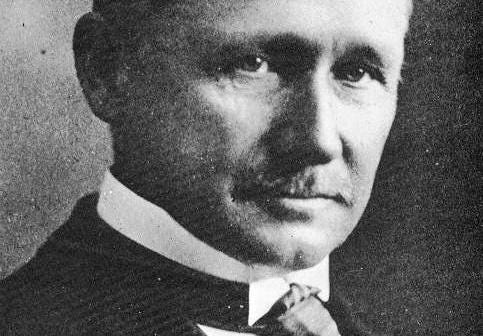

> _“The most important, and indeed the truly unique, contribution of management in the 20th century was the fifty-fold increase in the productivity of the manual worker in manufacturing.”  
> “20世纪管理最重要，实际上是真正独特的贡献是制造业体力劳动生产率提高了五十倍。_
> 
> _— Peter Drucker — 彼得·德鲁克_

Peter Drucker, one of the most respected management thinkers in history, stated these words at the close of the 20th century.  
彼得·德鲁克（Peter Drucker）是历史上最受尊敬的管理思想家之一，他在20世纪末说了这些话。

The significance of this quote cannot be overstated.  
这句话的重要性怎么强调都不为过。

Drucker isn’t just talking about 50x productivity for the smartest people. He’s talking about 50x productivity _on average_ for an _entire society_. It’s profound historically. It’s profound personally. It’s profound societally.  
德鲁克不只是在谈论最聪明的人的50倍生产力。他说的是整个社会平均50倍的生产力。这在历史上是深刻的。就个人而言，这是深刻的。这是深刻的社会。

-   **Historical Profundity:** The sudden rise in worker productivity is a historical anomaly. Drucker says, “For hundreds of years there had been no increase in the ability of workers to turn out goods or to move goods.”  
    历史深刻性：工人生产率的突然提高是一个历史反常现象。德鲁克说：“数百年来，工人生产货物或运输货物的能力没有提高。
-   **Personal Profundity:** Imagine if you could do an entire week’s work in less than an hour? Or imagine if you could work a full work week, but got 50x the results of everyone else? It would catapult your career — your salary, your impact, your reputation, your self-confidence.  
    个人深度：想象一下，如果你能在不到一个小时的时间内完成整整一周的工作？或者想象一下，如果你可以工作一整周，但得到的结果是其他人的 50 倍？它会推动你的职业生涯——你的薪水、你的影响力、你的声誉、你的自信。
-   **Societal Profundity:** Over the long run, productivity determines what governments societies adopt. If productivity drops for too long, revolutions happen. If productivity goes up, the system stays because workers enjoy higher incomes and more leisure time. Drucker believes that had the productivity revolution not happened, capitalism may have fallen to communism during the Great Depression.  
    社会深度：从长远来看，生产力决定了社会采用的政府。如果生产率下降太久，革命就会发生。如果生产率提高，系统就会继续存在，因为工人享有更高的收入和更多的闲暇时间。德鲁克认为，如果生产力革命没有发生，资本主义可能在大萧条期间沦落到共产主义的手中。

Yet, something very odd happened in the last 50 years.  
然而，在过去的50年里，发生了一件非常奇怪的事情。

At the exact point you’d expect another 50x increase in productivity because of computers, there was stagnation in the United States…  
在你期望生产力再提高 50 倍的确切时间点，因为计算机，美国停滞不前......

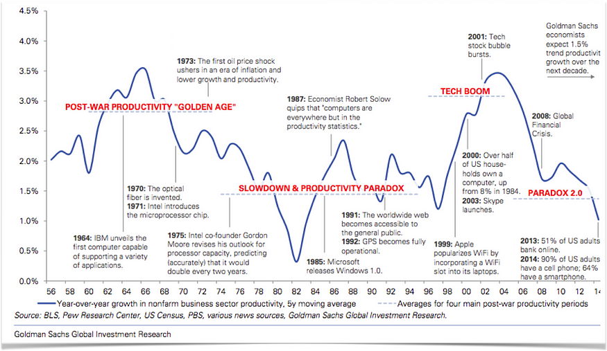

…and in other developed countries…  
...而在其他发达国家...

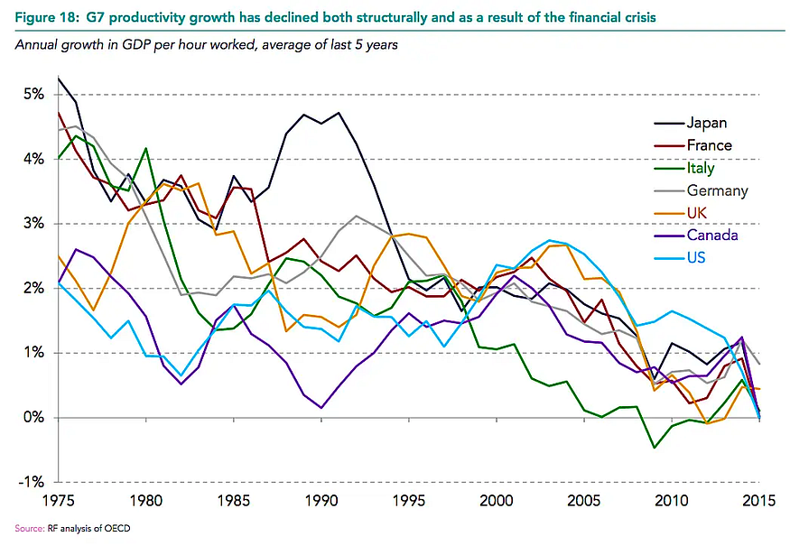

The oddness of this surprise is captured in the following quote by a Nobel laureate economist:  
这种惊喜的奇怪之处体现在一位诺贝尔经济学奖得主的以下引述中：

> _“You can see the computer age everywhere but in the productivity statistics.”  
> “你可以在任何地方看到计算机时代，但在生产力统计数据中。_
> 
> _—_ Nobel laureate Robert Solow ——诺贝尔奖获得者罗伯特·索洛

What’s going on here? 这是怎么回事？

A single employee with a laptop can do more than a roomful of people from the 1960s. Yet, we aren’t seeing this in the productivity data.  
一个拥有笔记本电脑的员工可以做的不仅仅是 1960 年代的一屋子人。然而，我们在生产力数据中没有看到这一点。

How is it that we make one of the most significant shifts in history and don’t see big, undeniable results from it?  
为什么我们做出了历史上最重要的转变之一，却没有看到不可否认的重大结果？

This surprising phenomenon is known as the productivity paradox.  
这种令人惊讶的现象被称为生产力悖论。

This paradox led Drucker to issue a challenge for our generation…  
这个悖论促使德鲁克向我们这一代人发出挑战......

> _“The most important contribution management needs to make in the 21st century is similarly to increase the productivity of knowledge work and knowledge workers.”  
> “在21世纪，管理层需要做出的最重要的贡献同样是提高知识工作和知识工作者的生产力。_
> 
> — Peter Drucker — 彼得·德鲁克

When I first read these words in 2018, I was shocked and inspired. So, I decided to dive deeper…  
当我在2018年第一次读到这些文字时，我感到震惊和鼓舞。所以，我决定更深入地研究...

## Millions Of Articles On Shallow Productivity Hacks… But Almost None On 50X Productivity  
数以百万计的关于浅层生产力黑客的文章...但在 50 倍生产力上几乎没有

My first surprise was this: 我的第一个惊喜是这样的：

-   There are hundreds of millions of pages on the Internet that mention productivity. In fact, there is a whole cottage industry of articles, books, and videos on productivity by productivity gurus.  
    互联网上有数亿个页面提到生产力。事实上，生产力大师关于生产力的文章、书籍和视频贯穿了整个家庭手工业。
-   Yet, most people into productivity (including myself) had never heard of the most important breakthrough in the history of productivity or the person behind it.  
    然而，大多数对生产力感兴趣的人（包括我自己）从未听说过生产力历史上最重要的突破或其背后的人。

It’s like collectively learning a philosophy (scientific method) or discovering a technology (steam engine) that changes everything and then removing it from the history books and subsequently forgetting about it.  
这就像集体学习一种哲学（科学方法）或发现一种改变一切的技术（蒸汽机），然后将其从历史书中删除，然后忘记它。

So, I became hooked. I wanted to understand why the 50x shift happened in the first place and how to replicate it with knowledge work instead of just manual work. After all, who doesn’t want a 50x productivity boost?  
所以，我迷上了。我想了解为什么首先会发生 50 倍转变，以及如何通过知识工作而不仅仅是手工工作来复制它。毕竟，谁不希望生产力提高 50 倍？

Furthermore, we can see the consequences of the recent productivity stagnation in many areas of politics and culture — from social rifts between classes to key issues in elections. When the pie isn’t growing, people fiercely fight to divvy up what’s left and tear down existing institutions. So, increasing productivity is an important social issue as well.  
此外，我们可以看到最近生产力停滞在许多政治和文化领域的后果——从阶级之间的社会裂痕到选举中的关键问题。当蛋糕没有增长时，人们会激烈地争取瓜分剩下的东西并拆除现有的机构。因此，提高生产率也是一个重要的社会问题。

Naively, I thought I would find an answer quickly and write an article about it. But, as I dove deeper into the literature on knowledge work productivity, I realized that the topic was still unsolved.  
天真地，我以为我会很快找到答案并写一篇关于它的文章。但是，当我深入研究有关知识工作效率的文献时，我意识到这个话题仍未解决。

Therefore, rather than rushing something out, I went on a multi-year research journey through dozens of academic articles and books. Some of my favorite being:  
因此，我没有急于求成，而是通过数十篇学术文章和书籍进行了多年的研究之旅。我最喜欢的一些是：

-   [Knowledge Work Factory](https://amzn.to/3Kcvnlp) by William Heitman  
    威廉·海特曼的知识工作工厂
-   [America’s Assembly Line](https://amzn.to/3Mdsenc) by David Nye  
    大卫·奈的《美国装配线》
-   [Principles Of Scientific Management](https://amzn.to/3vBPt4z) by Frederick Winslow Taylor  
    弗雷德里克·温斯洛·泰勒的科学管理原理
-   [Competitive Advantage](https://amzn.to/36T5qcd) by Michael Porter  
    迈克尔·波特的竞争优势
-   [The Effective Executive](https://amzn.to/35q8exa) by Peter Drucker  
    彼得·德鲁克的《有效的执行官》
-   [The Rise Of The Knowledge Society](http://archive.wilsonquarterly.com/essays/rise-knowledge-society-0) by Peter Drucker  
    彼得·德鲁克的《知识社会的兴起》
-   [The One Best Way](https://amzn.to/3vBlcCM) by Robert Kanigel  
    罗伯特·卡尼格尔的《一种最佳方式》
-   [My Life And Work](https://amzn.to/3tKKADV) by Henry Ford  
    亨利·福特的《我的生活与工作》
-   [Knowledge Worker Productivity](http://genderi.org/pars_docs/refs/63/62938/62938.pdf) by Peter Drucker  
    《知识工作者生产力》（Knowledge Worker Productivity），作者：Peter Drucker

By the end, I found a surprisingly simple 4-step framework (backed by more than 100 years of proof) that could be applied to knowledge work. But, before we understand the framework, it’s critical to first understand the fascinating person behind it along with the process he used to discover it…  
最后，我发现了一个非常简单的4步框架（有100多年的证明支持），可以应用于知识工作。但是，在我们理解这个框架之前，首先要了解它背后的迷人人物以及他发现它的过程是至关重要的......

## A Forgotten Thinker, Who Started Off As a Machine Shop Laborer, Sparked The Productivity Revolution  
一位被遗忘的思想家，最初是一名机械车间工人，引发了生产力革命

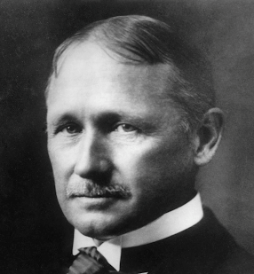

If you read Drucker, there is no confusion about the root cause of the productivity revolution. It all goes back to one person — Frederick Winslow Taylor.  
如果你读过德鲁克，就不会混淆生产力革命的根本原因。这一切都可以追溯到一个人——弗雷德里克·温斯洛·泰勒。

> _“In the decade after Frederick Winslow Taylor first looked at work and studied it, the productivity of the manual worker began its unprecedented rise… On this achievement rest all of the economic and social gains of the 20th century.”  
> “在弗雷德里克·温斯洛·泰勒（Frederick Winslow Taylor）首次审视工作并研究工作的十年中，体力劳动者的生产力开始了前所未有的上升......这一成就取决于20世纪的所有经济和社会成果。_
> 
> _— Peter Drucker — 彼得·德鲁克_

Drucker not only considers Taylor to be the creator of the science of management, he sees him as one of the three most important “makers of the modern world.” In fact, [he attributes](http://genderi.org/pars_docs/refs/63/62938/62938.pdf) almost all of the important management innovations in the last century (industrial engineering, work enrichment, job rotation, assembly line, total quality management, quality circle, continuous improvement, and lean manufacturing) back to Taylor.  
德鲁克不仅认为泰勒是管理科学的创造者，而且认为泰勒是最重要的三个“现代世界创造者”之一。事实上，他将上个世纪几乎所有重要的管理创新（工业工程、工作充实、工作轮换、流水线、全面质量管理、质量圈、持续改进和精益制造）都归功于泰勒。

Drucker is not alone in his assessment. In 1977, Taylor was ranked the #1 contributor ever to management thought and practice by a panel of business and economics historians beating out the likes of John Rockefeller, Andrew Carnegie, Alfred Sloan, Thomas Edison, and Henry Ford. Similarly, when the Academy Of Management, the academic association for the management discipline, was given the same task, Taylor again topped the list. To put his lead in perspective, Taylor had 31 first place votes. The next person down had three.  
德鲁克并不是唯一一个有这种评价的人。1977年，泰勒被一个商业和经济历史学家小组评为管理思想和实践的#1贡献者，击败了约翰洛克菲勒，安德鲁卡内基，阿尔弗雷德斯隆，托马斯爱迪生和亨利福特等人。同样，当管理学科的学术协会管理学院被赋予同样的任务时，泰勒再次位居榜首。为了正确看待他的领先优势，泰勒获得了31张第一名的选票。下一个下来的人有三个。

Furthermore, Taylor was a celebrity in his own era. According to his biographer:  
此外，泰勒在他自己的时代是名人。根据他的传记作者的说法：

> _“At the peak of his celebrity in the early twentieth century, Taylor gave lectures around the country and was as famous as Edison or Ford.”  
> “在二十世纪初名气的顶峰，泰勒在全国各地演讲，与爱迪生或福特一样出名。_
> 
> _—_Robert Kanigel ——罗伯特·卡尼格尔

To understand why Taylor was so widely known and respected, we need to look back at his life, which is eccentric enough to be a Hollywood script…  
要理解为什么泰勒如此广为人知和尊重，我们需要回顾一下他的一生，他的一生古怪到足以成为好莱坞剧本......

Taylor was born in 1856 and brought up as an aristocrat. His father was a Princeton-educated lawyer and Taylor went to Phillips Exeter Academy — one of the country’s top private schools. He was also a high achiever. By the end of high school, he was accepted to Harvard and had plans to become a lawyer just like his father.  
泰勒出生于1856年，成长为贵族。他的父亲是普林斯顿大学毕业的律师，泰勒去了菲利普斯埃克塞特学院——美国顶尖的私立学校之一。他也是一个高成就者。高中毕业后，他被哈佛大学录取，并计划像父亲一样成为一名律师。

However, while studying 4–5 hours per night in order to keep up in the pressure cooker environment, he started getting headaches that became more and more severe. Not knowing what the root cause was and fearing it would get worse, Taylor dropped out of high school, decided not to go to Harvard, and chose a profession that would be less taxing on his eyes.  
然而，在每晚学习 4-5 小时以跟上高压锅环境时，他开始头痛变得越来越严重。泰勒不知道根本原因是什么，担心情况会变得更糟，他从高中辍学，决定不去哈佛，并选择了一个对他的眼睛负担较小的职业。

Taylor was later diagnosed with the eye condition of Astigmatism. A condition which today is easy to diagnose and fix. Straining to focus on words was what caused the headaches. Although corrective lenses had come to America in 1862, the condition and solution had not become widely known by 1874 when Taylor dropped out. **So, by a weird quirk of fate, Taylor went to the shop floor as an apprentice machinist rather than Harvard to become a lawyer.**  
泰勒后来被诊断出患有散光的眼部疾病。今天很容易诊断和修复的情况。努力专注于文字是导致头痛的原因。虽然矫正镜片在1862年来到美国，但到1874年泰勒退出时，这种状况和解决方案还没有广为人知。因此，由于命运的怪癖，泰勒以机械学徒的身份进入车间，而不是哈佛成为一名律师。

As a machinist, he noticed that the workmen were not working nearly as hard as they could — often working at the slowest pace they could without getting punished. At the age of 25, when he became a foreman in a steel plant, he started to experiment with how worker productivity could be improved.  
作为一名机械师，他注意到工人们并没有尽其所能地工作——经常以最慢的速度工作而不会受到惩罚。25岁时，当他成为一家钢铁厂的领班时，他开始尝试如何提高工人的生产力。

From there, he hit his stride. Over the next few years, his responsibilities grew from foreman, to master mechanic, to chief draftsman, to chief engineer. His ambitions were not small:  
从那里，他大步前进。在接下来的几年里，他的职责从工头到机械大师，到首席绘图员，再到总工程师。他的野心不小：

> _“My head was full of wonderful and great projects to simplify the processes, to design new machinery, to revolutionize the methods of the whole establishment.”  
> “我的脑子里装满了精彩而伟大的项目，以简化流程，设计新机器，彻底改变整个机构的方法。_

During these years, Taylor envisioned and tested the components that would eventually become his science of management. Furthermore, he became rich very early on through his metalworking inventions — ultimately having more than 40 patents to his name. At the age of 37, Taylor decided to help other companies implement what he had learned. And so he became one of the first management consultants ever.  
在这些年里，泰勒设想并测试了最终成为他的管理科学的组成部分。此外，他很早就通过他的金属加工发明致富——最终拥有 40 多项专利。37岁时，泰勒决定帮助其他公司实施他所学到的知识。因此，他成为有史以来最早的管理顾问之一。

Later in his career, Taylor committed himself to evangelizing the principles of scientific management. In 1911, at the age of 55, he published his magnum opus — [Principles Of Scientific Management](https://amzn.to/3gK5QTV) and went on the speaking circuit.  
在他职业生涯的后期，泰勒致力于传播科学管理的原则。1911年，55岁的他出版了他的巨著《科学管理原理》，并巡回演讲。

We can see evidence of Taylor’s zeal for his philosophy in a letter to his brother-in-law…  
我们可以在给他姐夫的一封信中看到泰勒对他的哲学的热情的证据......

> _…I have been out of business, that is, money-making business, for about nine years, and during this period I have devoted all of my spare time to the object of promoting modern scientific management. In this I feel I can accomplish much more than I could in any other way, because it has been practically my life’s work; and I also think it is my duty to devote my time and money to this cause, for the reason that there is no one else in the country who is in a position to accomplish what I am able to do in this direction.  
> ...我离开这个行业，也就是赚钱的行业，已经有九年左右了，在这期间，我把所有的业余时间都花在了推动现代科学管理的目标上。在这方面，我觉得我可以比其他任何方式取得更多的成就，因为这实际上是我一生的工作;我也认为我有责任将我的时间和金钱投入到这项事业中，因为该国没有其他人能够完成我在这方面能够做的事情。_

**Taylor did not just view the principles of scientific management as only being applicable to manual work factories.** He, himself, wrote that the principles of scientific management “can be applied with equal force to all social activities: to the management of our homes; the management of our farms; the management of the business of our tradesmen, large and small; of our churches, our philanthropic institutions, our universities, and our governmental departments.”  
泰勒不仅认为科学管理的原则只适用于手工工厂。他自己写道，科学管理的原则“可以同样适用于所有社会活动：管理我们的家庭;我们农场的管理;管理我们大大小小的商人的业务;我们的教会，我们的慈善机构，我们的大学和我们的政府部门。

According to his biographer, many from other fields agreed with Taylor. “Look back to 1910 and the first explosion of interest in scientific management and you see field after field absorbing its message” including offices, hospitals, libraries, prisons, and schools.  
根据他的传记作者的说法，许多其他领域的人都同意泰勒的观点。“回顾1910年和对科学管理兴趣的第一次爆炸式增长，你会看到一个又一个领域正在吸收它的信息”，包括办公室，医院，图书馆，监狱和学校。

In fact, he even applied the principles to become a world-class tennis and golf player (he won the national doubles championship in 1881). And true to form, the principles of scientific management helped him create unorthodox but extremely effective motions and create new tools. He patented everything from new tennis racquet and golf club designs to turf management techniques and tennis net designs.  
事实上，他甚至运用这些原则成为世界级的网球和高尔夫运动员（他在 1881 年赢得了全国双打冠军）。科学管理的原则帮助他创造了非正统但极其有效的运动，并创造了新的工具。他申请了从新的网球拍和高尔夫球杆设计到草坪管理技术和网球网设计的所有专利。

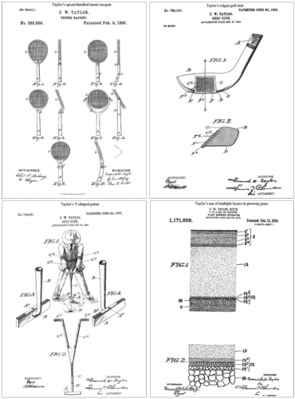

And so we got the foundational theory for the 50x productivity revolution from an ambitious man who through a quirk of fate lived two contradictory lives. One life was spent working 10–11 hours a day on the shop floor. The other was spent playing tennis and golf at country clubs while also “studying physics and mathematics at home, singing in choral groups,” among other activities. If Taylor’s astigmatism had been cured, he likely would’ve become a successful lawyer unknown to the annals of history.  
因此，我们从一个雄心勃勃的人那里得到了50倍生产力革命的基本理论，他通过命运的怪癖过着两种矛盾的生活。一生每天在车间工作10-11个小时。另一个是在乡村俱乐部打网球和高尔夫球，同时还“在家学习物理和数学，在合唱团唱歌”等活动。如果泰勒的散光被治愈，他很可能会成为一名历史上不为人知的成功律师。

Educated on the critical role that Taylor played in the productivity revolution, I was ready to deep dive on the fundamental principles that caused the 50x productivity revolution in manual work…  
了解了泰勒在生产力革命中发挥的关键作用，我准备深入研究导致手工工作 50 倍生产力革命的基本原则......

## What Caused The 50x Manual Worker Revolution Boom Is Surprising  
是什么导致了50倍体力劳动者革命的繁荣令人惊讶

The core thesis of Taylor’s [Principles Of Scientific Management](https://amzn.to/3gK5QTV) boils down to applying the scientific method to productivity using the following 4-step process:  
泰勒科学管理原理的核心论点归结为使用以下 4 步过程将科学方法应用于生产力：

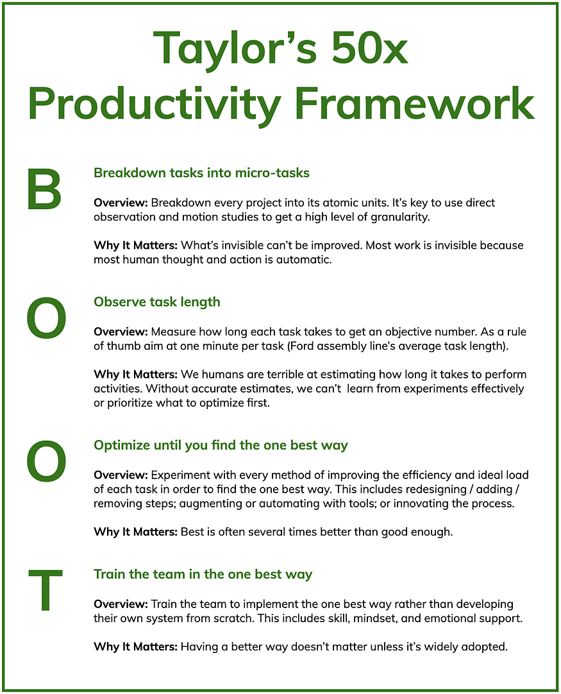

**Using this system, Taylor achieved astounding results for tasks you would think are impossible to improve.  
使用这个系统，泰勒在你认为不可能改进的任务上取得了惊人的结果。**

Take something as simple as shoveling. Having been in existence for some 7,000 years, you would think that the optimal approach had been figured out long ago. Interestingly, this was not the case. In 1898, Taylor was hired by Bethlehem Steel to make its 600 shovelers more productive. So, he endeavored to create a science of shoveling.  
拿铲子这么简单的事情。已经存在了大约7000年，你会认为很久以前就已经找到了最佳方法。有趣的是，事实并非如此。1898年，泰勒被伯利恒钢铁公司聘用，以提高其600名铲屎官的生产力。因此，他努力创造一门铲屎学。

First, Taylor questioned basic assumptions:  
首先，泰勒质疑基本假设：

> _For a first-class shoveler there is a given shovel load at which he will do his biggest day’s work. What is this shovel load? Will a first-class man do more work per day with a shovel load of 5 pounds, 10 pounds, 15 pounds, 20, 25, 30, or 40 pounds?  
> 对于一流的铲屎官来说，有一个给定的铲子负荷，他将完成他最重要的一天工作。这个铲子负载是多少？一个一流的人每天用5磅、10磅、15磅、20磅、25磅、30磅或40磅的铲子做更多的工作吗？_

Next, he answers these questions with time and motion studies combined with experiments on:  
接下来，他通过时间和运动研究结合以下实验来回答这些问题：

-   Kinds of shovels (they settled on 8–10)  
    铲子的种类（他们确定在 8-10 个）
-   Shoveling techniques (testing various distances, weights, and heights)  
    铲子技术（测试各种距离、重量和高度）
-   Management systems (Training employees on the scientific method so they can perform experiments. Standardizing the winning experiments into the company processes and culture. Providing bonuses to individuals rather than having a common group wage.)  
    管理系统（对员工进行科学方法的培训，以便他们进行实验。将成功的实验标准化到公司流程和文化中。向个人提供奖金，而不是有共同的集体工资。

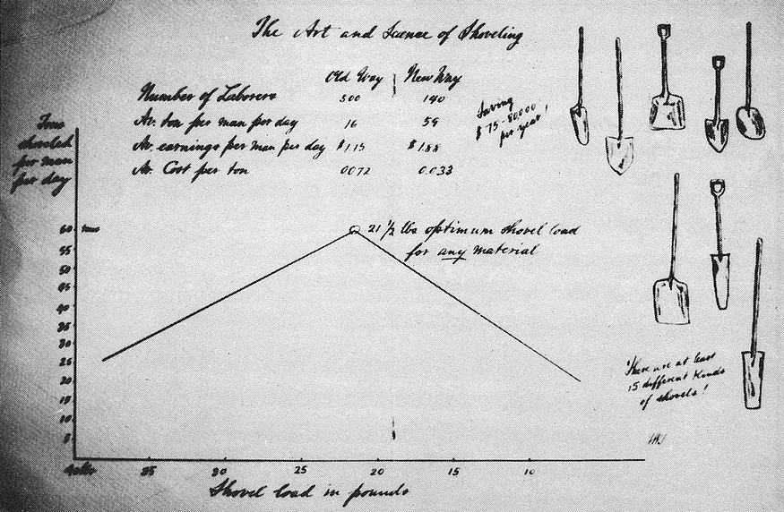

The Art And Science Of Shoveling  
铲土的艺术与科学

After much experimentation, he found the optimal shovel load was 21 pounds, which led to advertisements like this one…  
经过多次实验，他发现最佳的铲子负载是 21 磅，这导致了这样的广告......

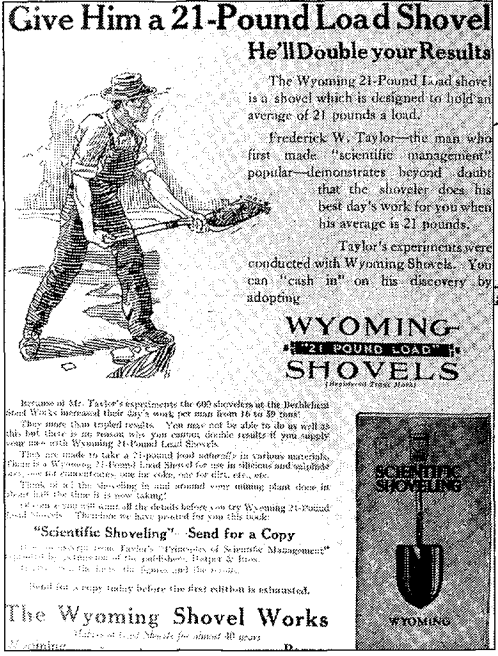

What was the end result of these shoveling experiments?  
这些铲子实验的最终结果是什么？

The output per man doubled. As a result, employees earned 35% more on average while the company paid significantly less.  
人均产出翻了一番。结果，员工的平均收入增加了 35%，而公司的工资要少得多。

All of this from turning the simple act of shoveling into a science.  
所有这些都是从简单的铲土行为变成一门科学。

Taylor gives other fascinating case studies in the book. One amazing example is bricklaying. Even though the trade had existed for 6,000 years and there had been almost no innovation for hundreds of years, two of Taylor’s students, Frank and Lillian Gilbreth, were able to improve efficiency by 3x. Using the principles of scientific management, they…  
泰勒在书中给出了其他引人入胜的案例研究。一个惊人的例子是砌砖。尽管这种贸易已经存在了6000年，数百年来几乎没有创新，但泰勒的两个学生弗兰克和莉莲吉尔布雷斯能够将效率提高3倍。使用科学管理的原则，他们...

-   Examined the movements of bricklaying frame-by-frame.  
    逐帧检查砌砖的运动。
-   Reduced the number of motions from 18 to 5.  
    议案数量从 18 个减少到 5 个。
-   Created custom tools. For example, they created a simple apparatus that held the bricks at the same height as the wall so they didn’t have to constantly bend down to pick them.  
    创建自定义工具。例如，他们创造了一个简单的装置，将砖块固定在与墙壁相同的高度，这样他们就不必经常弯腰捡起它们。
-   Taught people to use their hands simultaneously rather than in sequence.  
    教人们同时使用双手而不是按顺序使用。

_(Fun editorial note: Two of Frank and Lillian’s children co-authored the book Cheaper By The Dozen, which became a Hollywood movie three times—one of which starred Steve Martin. The Gilbreth’s home doubled as laboratory to test their ideas on education and efficiency.)  
（有趣的编者按：弗兰克和莉莲的两个孩子合著了《十几个便宜》一书，这本书三次成为好莱坞电影，其中一部由史蒂夫马丁主演。吉尔布雷斯的家兼作实验室，以测试他们对教育和效率的想法。_

Henry Ford also used the principles of scientific management. For example, one of Ford’s most famous management innovations came from breaking down how employees spent their time and realizing that half of a worker’s time was wasted simply walking between materials and tools. So Ford had the work come to workers rather than them walking to the work. This innovation was called the assembly line, and the increased productivity allowed Ford to drastically increase worker pay.  
亨利·福特也运用了科学管理的原则。例如，福特最著名的管理创新之一来自于分解员工如何花费时间，并意识到工人一半的时间被浪费在材料和工具之间。因此，福特让工作交给工人，而不是他们步行去工作。这项创新被称为装配线，生产力的提高使福特能够大幅提高工人工资。

One of my favorite optimization examples from [Ford’s autobiography](https://www.amazon.com/dp/B002RKR216/ref=dp-kindle-redirect?_encoding=UTF8&btkr=1) is a step-by-step overview of how he turned a 20-minute assembly job into a 5-minute one (a 4x improvement):  
福特自传中我最喜欢的优化示例之一是逐步概述他如何将 20 分钟的装配工作转变为 5 分钟的装配工作（改进了 4 倍）：

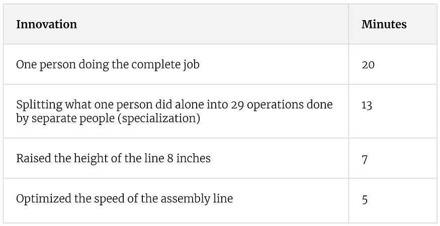

When reading about the drastic improvements in shoveling, bricklaying, and assembly, my mind was boggled. I didn’t understand how fields that had been around for thousands of years could be improved so easily and drastically — not by complex theories but by a simple process anyone could replicate. Taylor’s book shed light on the peculiarity…  
当读到铲土、砌砖和组装方面的巨大改进时，我的思绪令人难以置信。我不明白，已经存在了数千年的领域是如何如此容易和彻底地改进的——不是通过复杂的理论，而是通过任何人都可以复制的简单过程。泰勒的书揭示了这种特殊性......

-   **As a field evolves, it develops best practices.** Best practices are passed down from generation to generation.  
    随着一个领域的发展，它会开发最佳实践。最佳实践代代相传。
-   **These best practices go unexamined.** “Practically in no instances have they been codified or systematically analyzed or described,” explains Taylor.  
    这些最佳实践未经检验。“实际上，它们从未被编纂或系统地分析或描述，”泰勒解释说。
-   **There is a lot of diversity among practices.** Taylor adds, “Instead of having only one way which is generally accepted as a standard, there are in daily use, say, fifty or a hundred different ways of doing each element of the work.”  
    实践之间有很多多样性。泰勒补充说：“不是只有一种被普遍接受为标准的方法，而是在日常使用中，比如说，五十种或一百种不同的方法来完成工作的每个元素。
-   **This diverse body of practice based on “rule of thumb” is far from optimal.** You might think that if a profession has been around for decades and even centuries that it would discover the optimal processes and pass those down. However, Taylor’s work showed that this doesn’t happen. Even the most basic ancient tasks like shoveling or bricklaying could be done much more efficiently.  
    这种基于“经验法则”的多样化实践远非最佳。你可能会认为，如果一个职业已经存在了几十年甚至几个世纪，它就会发现最佳流程并将其传承下去。然而，泰勒的工作表明，这不会发生。即使是最基本的古代任务，如铲土或砌砖，也可以更有效地完成。

**Bottom line:**

-   Fields evolve to a point of being good enough, but not optimality.  
    字段发展到足够好，但不是最优的。
-   The good enough approach is significantly less efficient than the optimal approach.  
    足够好的方法比最佳方法的效率要低得多。
-   These huge improvements can be made via the surprisingly simple process of scientific management.  
    这些巨大的改进可以通过科学管理的惊人简单的过程来实现。

To summarize… 总结一下...

## What We Have Been Taught About Productivity Is Fundamentally Wrong  
我们被教导的关于生产力的东西从根本上是错误的

> **“Technology alone is rarely enough to create significant benefits.”  
> “仅靠技术很少足以创造重大利益。**
> 
> Georgios Petropoulos & Erik Brynjolfsson (MIT & Stanford researchers)  
> Georgios Petropoulos和Erik Brynjolfsson（麻省理工学院和斯坦福大学的研究人员）

When I was taught about the industrial revolution somewhere in middle school, I learned that it occurred because of electrified factories with big machines. Overall, I was left with the impression that the cause of the productivity boost was technology.  
当我在中学的某个地方被教导工业革命时，我了解到它的发生是因为电气化工厂配备了大型机器。总的来说，我留下的印象是生产力提高的原因是技术。

What I now know is that this viewpoint is only half the story. **Technology is not the fundamental cause of productivity. Simply mastering the latest and greatest tools will not take you to the promised land of productivity — despite many headlines on social media promising it.** This insight helps us understand why the introduction of the computer hasn’t led to as big and fast of a productivity boom as one might expect.  
我现在知道的是，这个观点只是故事的一半。技术不是生产力的根本原因。仅仅掌握最新和最好的工具不会带你进入生产力的应许之地——尽管社交媒体上的许多头条新闻都承诺了这一点。这种洞察力有助于我们理解为什么计算机的引入并没有像人们预期的那样带来如此大而快的生产力繁荣。

What history shows us is that the benefits of technology are not realized without the right production process — the steps you follow to create good or service.  
历史告诉我们，如果没有正确的生产过程——你创造商品或服务的步骤——技术的好处就无法实现。

**In other words, the production process is the fire. The technology is the gasoline that accelerates the fire.  
换句话说，生产过程就是火。技术是加速火灾的汽油。**

Optimizing the process first is deep productivity. It has the most leverage, but requires rethinking one’s whole production process, which takes a lot of time. **Finding quick hacks using the latest tools while using an unoptimized process is shallow productivity. It is like putting lipstick on a pig.** It provides quick bursts of productivity, but is not the ideal approach long-term.  
首先优化流程是深度生产力。它具有最大的杠杆作用，但需要重新思考整个生产过程，这需要花费大量时间。使用最新工具寻找快速黑客，同时使用未优化的流程是浅薄的生产力。这就像给猪涂口红一样。它提供了快速的生产力爆发，但从长远来看并不是理想的方法。

Now that we have a gist of how manual worker productivity skyrocketed as a result of Taylor’s scientific management, let’s fast forward to today. It’s been decades since the rise of knowledge work. So, of course, we would have taken Taylor’s ideas and fully applied them to knowledge work. Right?  
现在我们已经了解了泰勒的科学管理如何使体力劳动生产率飙升，让我们快进到今天。知识工作的兴起已经过去几十年了。所以，当然，我们会把泰勒的想法充分应用到知识工作中。右？

Not quite… 差一点。。。

## We Are Still In The 1800s Of Knowledge Work  
我们仍然处于知识工作的 1800 年代

> _The more you talk to knowledge workers about their work activities, the clearer it becomes that they, and their managers, have devoted almost no thought to this topic. The result? Every organization, often every individual, defines these “atomic-level” universal work activities inadvertently, randomly, and — of course — differently.  
> — William Heitman, author of_ [_Knowledge Work Factory_](https://amzn.to/3pyV33W)  
> 你与知识工作者谈论他们的工作活动越多，就越清楚地发现，他们和他们的经理几乎没有考虑过这个话题。结果呢？每个组织，通常是每个人，都无意中、随机地、当然还有不同的方式定义这些“原子级”的通用工作活动。——威廉·海特曼（William Heitman），《知识工作工厂》（Knowledge Work Factory）的作者

Let’s do a simple thought experiment. Let’s go through the average day of a knowledge worker and think about all of the tasks they perform:  
让我们做一个简单的思想实验。让我们回顾一下知识工作者的平均一天，并考虑他们执行的所有任务：

-   Prioritize the day with a to do list  
    使用待办事项列表确定当天的优先级
-   Exercise their craft 锻炼他们的手艺
-   Communicate with others (emails, meetings, memos, proposals)  
    与他人沟通（电子邮件、会议、备忘录、提案）
-   Make decisions
-   Solve problems
-   Learn
-   Teach
-   Innovate
-   Etc.

Now, let’s run these tasks through Taylor’s 50x Framework to see how well we collectively apply it to knowledge work:  
现在，让我们通过 Taylor 的 50x 框架运行这些任务，看看我们如何共同将其应用于知识工作：

-   **Task Breakdown.** Are most people aware that the knowledge work skills above even exist — let alone breaking them down into their individual micro-tasks?  
    任务细分。大多数人是否意识到上述知识工作技能甚至存在 - 更不用说将它们分解为单独的微任务了？
-   **Measurement how long each task takes.** Do most people track their time? If so, are they tracking their micro-tasks?  
    衡量每项任务需要多长时间。大多数人会跟踪他们的时间吗？如果是这样，他们是否在跟踪他们的微任务？
-   **Experiment to find the one best way.** Are people simply using good-enough rules of thumb or are they using the scientific method to find the optimal approach?  
    尝试找到一种最佳方法。人们只是使用足够好的经验法则，还是使用科学方法来找到最佳方法？
-   **Train for standardization.** Once the optimal approach has been figured out, are most people being trained in them?  
    标准化培训。一旦找到了最佳方法，大多数人是否正在接受培训？

Very quickly, it becomes clear that the answer to each of these is ‘no.’  
很快，很明显，每个问题的答案都是“不”。

Most knowledge workers are winging it or using a best practice from their specific boss, company, or job rather than using the most scientifically tested approach. People are mired in never-ending meetings, going through endless to-do lists, and constantly responding to emails without measuring their productivity.  
大多数知识工作者都在使用它，或者使用他们特定老板、公司或工作的最佳实践，而不是使用经过最科学测试的方法。人们陷入了永无止境的会议，浏览无休止的待办事项清单，并不断回复电子邮件而没有衡量他们的生产力。

For example, one of the hallmark studies of manual work industrialization is finding the optimal shovel load weight of 21 lbs (mentioned earlier). If workers attempt to carry too heavy of a load, they risk getting exhausted too quickly and getting injured. Whereas, with a lighter load, their overall productivity per day is higher. Similarly, [researchers](http://jbm.johogo.com/pdf/volume/1701/JBM-vol-1701.pdf#page=123) have made the case that there is an “optimal” load for knowledge consumption and that if we consume too much there are real consequences:  
例如，手工作业工业化的标志性研究之一是找到 21 磅的最佳铲负载重量（前面提到）。如果工人试图搬运太重的负载，他们可能会很快筋疲力尽并受伤。然而，负载越轻，他们每天的整体生产率就越高。同样，研究人员认为，知识消费存在“最佳”负荷，如果我们消费过多，就会产生真正的后果：

> “_Info_ _overload often leads to stress, inefficiency, and mistakes that can result in poor decisions, bad analysis, and/or miscommunication (Eppler & Mengis, 2004)._  
> “信息过载通常会导致压力，效率低下和错误，从而导致糟糕的决策，糟糕的分析，和/或沟通不畅（Eppler&Mengis，2004）。

Yet, there is no science on the ideal load for knowledge consumption.  
然而，没有关于知识消费的理想负荷的科学。

To put the cost of not industrializing knowledge work in context, William Heitman, author of [Knowledge Work Factory](https://amzn.to/3pyV33W) and consultant to major companies on knowledge work industrialization for nearly 30 years believes that:  
为了将不工业化知识工作的成本放在上下文中，《知识工作工厂》的作者、近30年来知识工作工业化大公司的顾问威廉·海特曼（William Heitman）认为：

> Today’s knowledge workers waste a third of their day, every day, on activities that could be reduced, consolidated, or eliminated altogether.  
> 如今的知识工作者每天将三分之一的时间浪费在可以减少、整合或完全消除的活动上。

**Altogether, it’s incredibly surprising to realize that knowledge work is still in its infancy and is using almost none of the proven techniques used during the most rapid productivity boom in human history.** It’s mind-boggling in the same way that it is mind-boggling that suitcase wheels weren’t standard until the 1980s.  
总而言之，令人难以置信的是，意识到知识工作仍处于起步阶段，几乎没有使用人类历史上最快速的生产力繁荣期间使用的经过验证的技术。令人难以置信的是，直到 1980 年代，手提箱轮才成为标准，这令人难以置信。

Fortunately, there is a silver lining. The fact that we’re in the 1800s of knowledge work means that all of us have the opportunity to be pioneers…  
幸运的是，有一线希望。我们处于 1800 年代的知识工作这一事实意味着我们所有人都有机会成为先驱......

## My Life Before And After The 50x Framework: Five Fundamental Changes  
我在 50x 框架之前和之后的生活：五个基本变化

Writing this article has been life-changing on two levels. It has fundamentally changed how I:  
写这篇文章在两个层面上改变了生活。它从根本上改变了我的方式：

-   View productivity
-   Organize my work 组织我的工作

What I now understand is that Taylor didn’t just introduce a new process for manual work. He introduced a universal productivity paradigm…  
我现在所理解的是，泰勒不只是引入了一种新的手工工作流程。他引入了一种普遍的生产力范式......

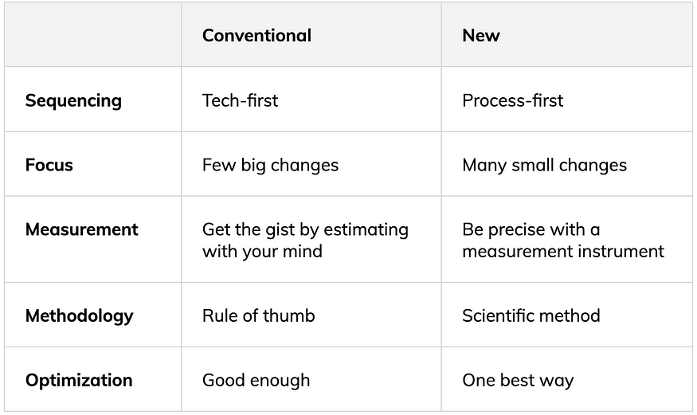

Before understanding this paradigm, the idea of becoming ultra efficient felt undesirable and unimportant. Now, I think the opposite:  
在理解这种范式之前，变得超高效的想法感到不可取和不重要。现在，我认为相反：

-   **Productivity doesn’t make us a machine.** One of the main reasons science has progressed so far is tools that help us get finer grain, objective perspectives on reality than our senses can. I now understand how timing myself and building a granular, objective map of my thought/action process can augment my humanness rather than stunting it.  
    生产力并不能使我们成为一台机器。到目前为止，科学进步的主要原因之一是帮助我们获得比我们的感官更精细、更客观的现实视角的工具。我现在明白了如何安排自己的时间并建立一个精细的、客观的思想/行动过程地图可以增强我的人性，而不是阻碍它。
-   **Productivity is good.** There is a cottage industry of writers who shoot down the frivolity of productivity. But, now I see that increasing society’s average productivity means fewer revolutions, less cultural warfare, less environmental waste, and higher quality of life (more leisure, better healthcare, etc). These are big deals. I now think society under-focuses on productivity.  
    生产力很好。作家有一个家庭手工业，他们击落生产力的轻浮。但是，现在我看到，提高社会的平均生产力意味着更少的革命，更少的文化战争，更少的环境浪费和更高的生活质量（更多的休闲，更好的医疗保健等）。这些都是大事。我现在认为社会对生产力的关注不足。
-   **Small productivity gains aren’t frivolous.** Amazing productivity gains come from small hacks, which individually seem frivolous, but together add up to mind-boggling change. Just like the microscope unveiled entire universes of organisms (viruses, germs) and matter (quarks, atoms), finer attention to detail opens a whole new world of productivity.  
    小幅的生产力提高并非轻率。惊人的生产力提升来自小黑客，这些黑客单独看起来很轻浮，但加起来却带来了令人难以置信的变化。就像显微镜揭示了生物（病毒、细菌）和物质（夸克、原子）的整个宇宙一样，对细节的更精细的关注打开了一个全新的生产力世界。
-   **Knowledge work productivity can be 50x’d.** Knowledge work is still in its infancy. This means that the potential gains we can have with the existing tools may be much larger than anyone thinks.  
    知识工作效率可以是50倍。知识工作仍处于起步阶段。这意味着我们利用现有工具可以获得的潜在收益可能比任何人想象的都要大得多。
-   **Productivity is essential to non-productivity.** The more efficient we are at work individually and collectively, the more time we have to carve out for slow, deep living not based on optimization. To put the impact of efficiency in context, the average work week in manufacturing in 1840 was about 68 hours according to the [U.S. Department of Interior](https://eh.net/encyclopedia/hours-of-work-in-u-s-history/). By 1988, that had fallen to less than 40 hours per week. That’s about 1,000 more hours per year of leisure.  
    生产力对非生产力至关重要。我们个人和集体的工作效率越高，我们就越有时间去追求缓慢而深入的生活，而不是基于优化。为了将效率的影响放在上下文中，根据美国内政部的数据，1840年制造业的平均工作周约为68小时。到1988年，这一数字下降到每周不到40小时。这相当于每年多1000个小时的休闲时间。
-   **It’s worth each of us individually spending hundreds (if not thousands) of hours improving our productivity.** We all have our own knowledge work factory. But, rather than just running the factory, we should also focus on improving it. Elon Musk captures the significance of this in the following quote: “We realized that the true problem, the true difficulty, and where the greatest potential is — is building the machine that makes the machine. In other words, it’s building the factory. I’m really thinking of the factory like a product.” Elsewhere, he goes so far as to say that, “Tesla’s long-term competitive advantage will be manufacturing.”  
    我们每个人都值得花费数百（如果不是数千）小时来提高我们的生产力。我们都有自己的知识工厂。但是，我们不应该仅仅经营工厂，还应该专注于改进它。埃隆·马斯克（Elon Musk）在以下引述中抓住了这一点的重要性：“我们意识到真正的问题，真正的困难，以及最大的潜力所在 - 是制造制造机器的机器。换句话说，它正在建造工厂。我真的把工厂当成一个产品。在其他地方，他甚至说，“特斯拉的长期竞争优势将是制造业。

**Going through this personal transformation has inspired me to more methodically apply Taylor’s ideas to my own work.** Before coming across his work, I was already thinking systematically about:  
经历这种个人转变激发了我更有条不紊地将泰勒的想法应用到我自己的工作中。在接触他的作品之前，我已经在系统地思考：

-   Learning how to learn (knowledge learning)  
    学习如何学习（知识学习）
-   Engineering epiphanies (knowledge creation)  
    工程顿悟（知识创造）
-   Online writing (knowledge sharing)  
    在线写作（知识共享）

But, Taylor’s framework helped take things to the next level. Over the last several years, my team and I have spent many thousands of hours following the steps below:  
但是，泰勒的框架帮助将事情提升到了一个新的水平。在过去的几年里，我和我的团队花了数千个小时遵循以下步骤：

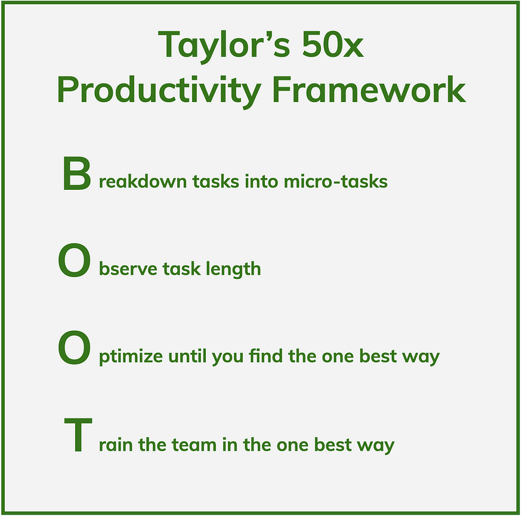

The journey of applying these steps has been lots of things — eye-opening, winding, complicated, time-consuming, challenging, exhilarating and insightful. I have:  
应用这些步骤的过程有很多事情——令人大开眼界、曲折、复杂、耗时、具有挑战性、令人振奋和富有洞察力。我有：

-   Spent 1,000+ hours studying the patterns of top online writers via [Buzzsumo](https://buzzsumo.com/).  
    花了1，000 +小时通过Buzzsumo研究顶级在线作家的模式。
-   Hired over ten of the top online writers as consultants to help me walk through their article creation process step-by-step.  
    聘请了十多位顶级在线作家作为顾问，帮助我逐步完成他们的文章创建过程。
-   Used this knowledge to come up with theories on better ways to approach the process of writing.  
    利用这些知识提出了关于处理写作过程的更好方法的理论。
-   Performed over 4,000 A/B tests to understand what works and what doesn’t from the theories  
    执行了 4，000 多次 A/B 测试，以了解理论中哪些有效，哪些无效
-   Turned these lessons into longform [blockbuster articles](https://medium.com/accelerated-intelligence/the-1-mental-model-for-writers-who-want-to-write-high-quality-viral-content-43ecf0d4ec05) that have now gotten tens of millions of views in Fortune, Forbes, Inc., Harvard Business Review, and other top publications.  
    将这些教训转化为长篇大片文章，现已在《财富》、《福布斯》、《哈佛商业评论》和其他顶级出版物上获得了数千万的浏览量。
-   Personally taught and coached hundreds of students one-on-one over four years so I could see where students get stuck and troubleshoot why in order to help students get better results and to make our breakdown of steps more granular and accurate.  
    在四年的时间里，我亲自一对一地教授和指导了数百名学生，因此我可以看到学生卡在哪里并排除原因，以帮助学生获得更好的结果，并使我们的步骤细分更加精细和准确。
-   Refined the research process over a long period of time. I’ve read well over 1,000 books over my adult life, spent over 1,000 hours studying learning how to learn, and taught several live cohorts of our learning how to learn course.  
    在很长一段时间内完善了研究过程。在我的成年生活中，我读了1000多本书，花了1000多个小时学习学习如何学习，并教了我们几个学习如何学习课程的现场队列。
-   Refined the process for coming up with ideas. More specifically, I’ve spent four years studying the most important mental models and then creating a 10,000-word mastery manual every month (48 in total) in order to understand the specific mental steps to making better decisions and being more creative.  
    完善了提出想法的过程。更具体地说，我花了四年时间研究最重要的心智模型，然后每个月创建一本10，000字的掌握手册（总共48个），以了解做出更好决策和更具创造力的具体心理步骤。

While the journey might sound easy and linear when I share the highlight reel, the reality is that it has also been hard on multiple levels:  
虽然当我分享精彩片段时，旅程听起来可能很容易和线性，但现实是，它在多个层面上也很困难：

-   **It has taken many years,** and we’re still just scratching the surface. For example, I’ve never timed my work. I anticipate that we’ll be building our knowledge factory for at least five more years.  
    这已经花了很多年，我们仍然只是触及了表面。例如，我从来没有为我的工作计时。我预计我们将至少再建立五年的知识工厂。
-   **It requires a** [**long-term**](https://medium.com/accelerated-intelligence/these-billionaire-ceos-see-the-world-differently-because-they-see-time-differently-faa2909e8fa2)**, probabilistic thinking mindset.** Spending hours doing deep analysis directly took away time from writing articles or growing the business in the short-term. Making those tradeoffs has been and still is difficult. It requires valuing changes that will payoff over years rather than weeks. And, it requires making lots of probabilistic bets that may or may not payoff. The brutal reality is that most experiments fail.  
    它需要一种长期的、概率性的思维方式。花费数小时进行深入分析直接占用了撰写文章或在短期内发展业务的时间。做出这些权衡过去和现在都很困难。它需要评估将在几年而不是几周内获得回报的变化。而且，它需要进行大量概率赌注，这些赌注可能会或可能不会带来回报。残酷的现实是，大多数实验都失败了。
-   **It requires team members and stakeholders that think the same way.** And even when you have the right team members, there will still be tension on whether the bets are worth it.  
    它需要团队成员和利益相关者以同样的方式思考。即使你有合适的团队成员，赌注是否值得仍然会感到紧张。

That’s been my journey so far with the 50x Framework.  
到目前为止，这就是我使用 50x 框架的旅程。

What will yours be? 你的会是什么？

## Become A 50x Knowledge Learner & Creator  
成为 50 倍的知识学习者和创造者

If you are the crazy type of person who has read the 5,000 words to get to this point and gets excited by the idea of geeking out on knowledge work productivity, then you are my people! :)  
如果你是那种疯狂的人，读了5000字才走到这一步，并对知识工作效率的想法感到兴奋，那么你就是我的人！:)

So, I have two ways to help you apply 50x to your life and for us to collaborate:  
因此，我有两种方法可以帮助您将50倍应用于您的生活以及我们合作：

**Idea #1: Free 5-Day Knowledge Work Challenge (includes Map Of Knowledge Work)  
想法#1：免费的5天知识工作挑战（包括知识工作地图）**

From November 28th to December 22nd, I’m doing a knowledge work challenge called Month To Master, and I’m making the first week of it free. In the free week-long challenge, I help you practice three of the most fundamental skills of knowledge work:  
从 11 月 28 日到 12 月 22 日，我正在做一个名为“掌握月”的知识工作挑战，我将免费提供它的第一周。在为期一周的免费挑战中，我帮助您练习知识工作的三个最基本的技能：

-   Selecting one micro-topic to learn (in a sea of information overwhelm)  
    选择一个微主题进行学习（在信息洪流中）
-   Building a curriculum to help you rapidly learn the micro-topic  
    构建课程以帮助您快速学习微主题
-   Sharing what you learn each day on a co-learning call, in order to deepen your learning, connect with others learning the same thing, and build your audience.  
    在共同学习电话会议上分享您每天学到的知识，以加深您的学习，与学习相同事物的其他人建立联系，并建立您的受众群体。

When you register, you also get my free Map Of Knowledge Work. This map has taken more than a year to create and is the direct result of using Taylor’s 50x Framework to break down the parts of knowledge work that I’m most familiar with: knowledge learning, creation, and sharing. I’d love to share it with you as part of the challenge.  
当您注册时，您还可以获得我的免费知识工作地图。这张地图花了一年多的时间创建，是使用 Taylor 的 50x 框架分解我最熟悉的知识工作部分的直接结果：知识学习、创造和共享。作为挑战的一部分，我很乐意与您分享。

[You can sign up here now >>  
您现在可以在这里注册>>](https://monthtomaster.co/free-challenge-50x/)

**Idea #2: 15-Month Live Coaching Program To Become A 50X Knowledge Creator  
想法#2：15个月的实时辅导计划，成为50倍的知识创造者**

If you want learn and write professionally, even if it’s part-time — I’d definitely recommend this to you.  
如果你想专业地学习和写作，即使是兼职——我肯定会推荐给你。

Since April earlier this year, I’ve been teaching a 15-month coaching program called Seminal, which helps knowledge creators — be it coaches, consultants, entrepreneurs or writers — to create blockbuster ideas, turn the ideas into blockbuster articles, and become the recognized experts in their fields.  
自今年4月初以来，我一直在教授一个名为Seminal的为期15个月的辅导计划，该计划帮助知识创造者 - 无论是教练，顾问，企业家还是作家 - 创造轰动一时的想法，将想法变成轰动一时的文章，并成为各自领域公认的专家。

Seminal is designed for people who love learning, love expressing themselves, are committed to mastering the skills of idea creation, and want to create ideas that leave a legacy.  
Seminal专为热爱学习，热爱表达自己，致力于掌握创意创造技能并希望创造留下遗产的想法的人而设计。

This program is for people who are super committed, and it’s the last time I will be teaching it live, as we plan to make this on-demand.  
这个程序是为那些超级投入的人准备的，这是我最后一次现场教授它，因为我们计划按需制作。

You can learn more about the philosophy that makes Seminal unique [here](https://medium.com/accelerated-intelligence/the-1-mental-model-for-writers-who-want-to-write-high-quality-viral-content-43ecf0d4ec05). And if you want to explore this further, you can apply (this helps me gauge if I can truly support you or not).  
您可以在此处了解有关使Seminal与众不同的哲学的更多信息。如果你想进一步探索这一点，你可以申请（这有助于我衡量我是否真的支持你）。

[Fill out this application form >>  
填写此申请表>>](https://seminal.lpages.co/blockbuster-application-50x/)

_If there’s a link to an Amazon book, it’s an affiliate link, which means I get a small amount of compensation when you buy the book. This compensation does not influence the specific books I recommend, as I only recommend books that I read and love.  
如果有指向亚马逊书籍的链接，那就是会员链接，这意味着当您购买该书时，我会获得少量补偿。这种补偿不会影响我推荐的具体书籍，因为我只推荐我读过和喜欢的书。_

_Special thanks to Matt Chambers, co-founder of_ [_Loxo_](https://loxo.co/)_, for helping to develop the ideas in this article._  
特别感谢 Loxo 的联合创始人 Matt Chambers 帮助发展本文中的想法。
