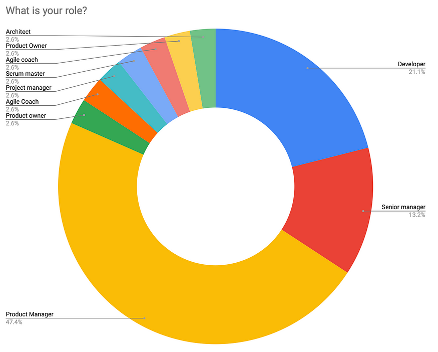
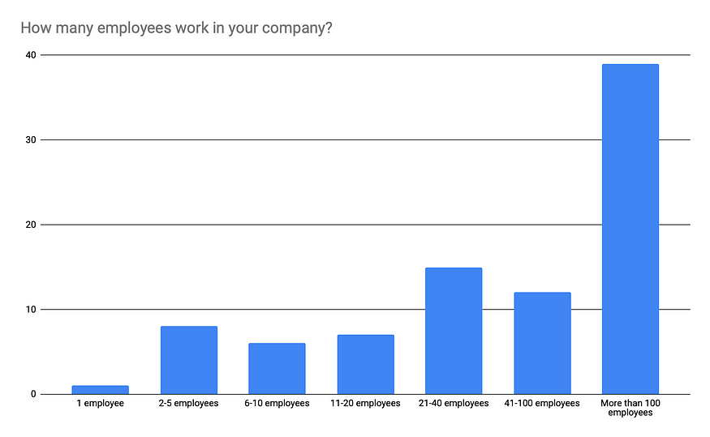
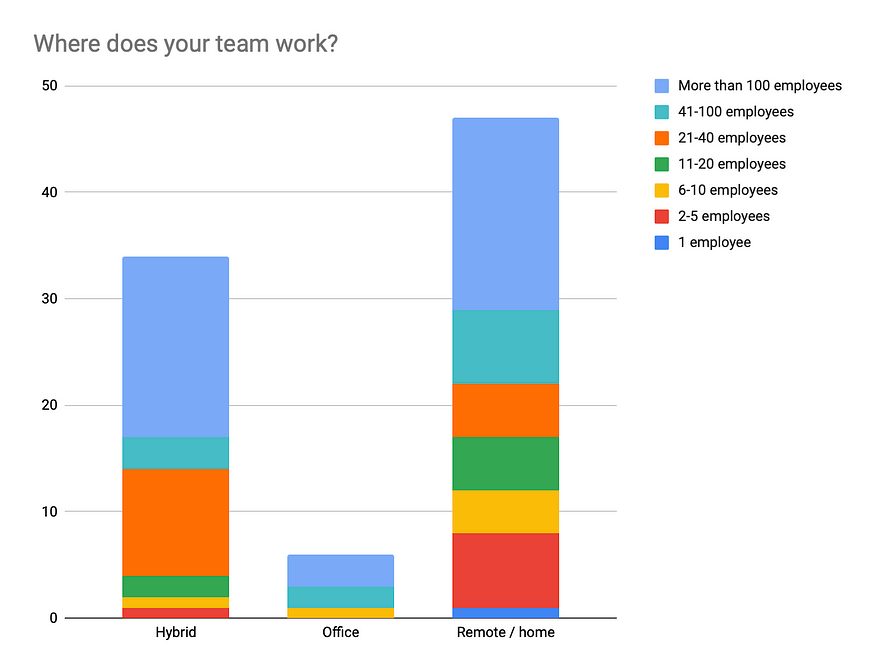
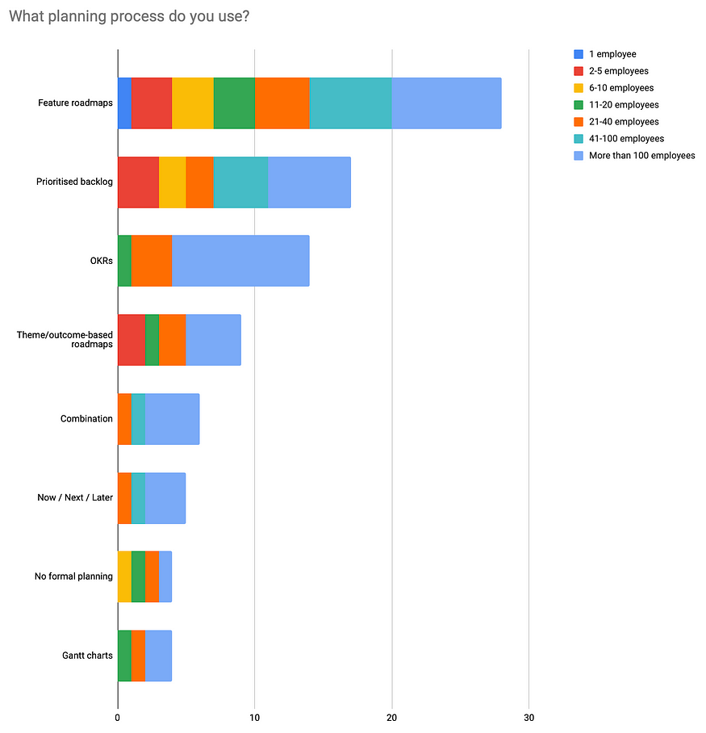
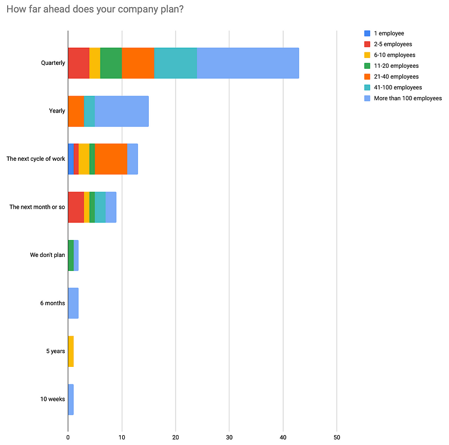
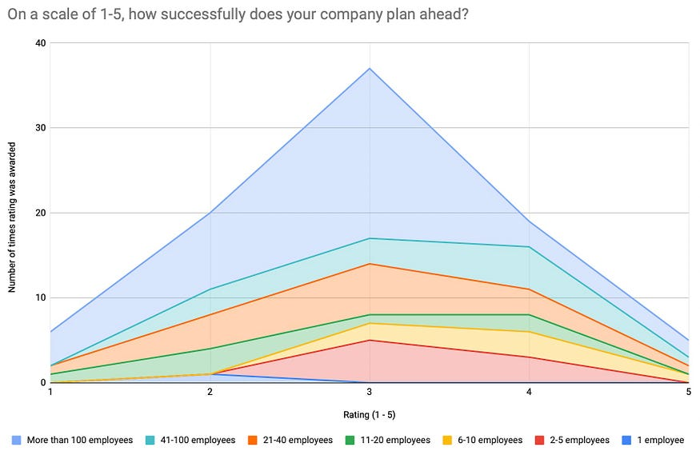
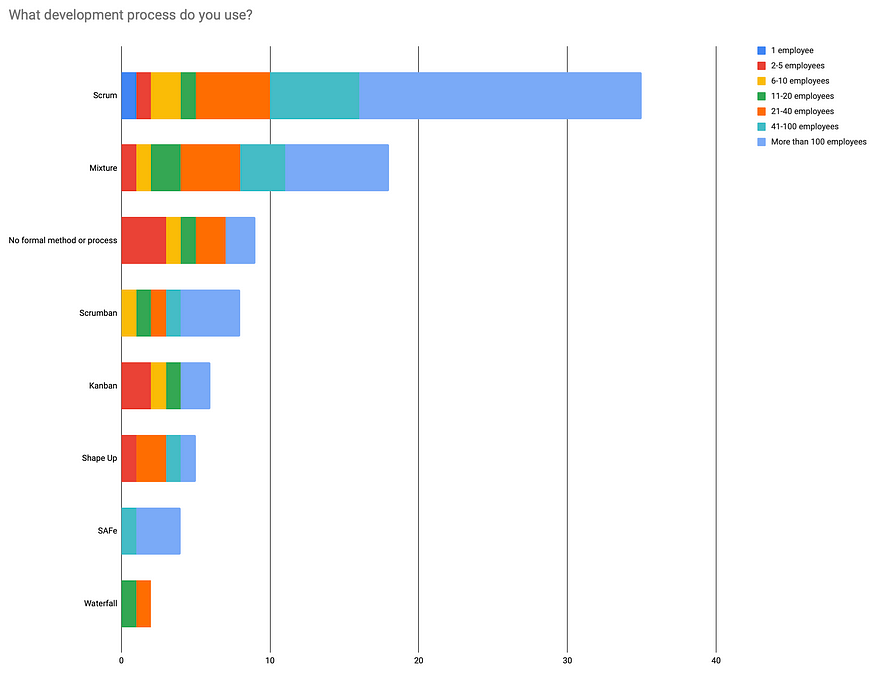
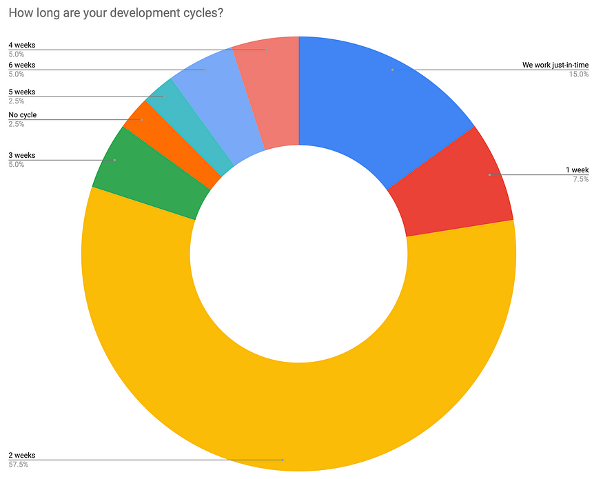
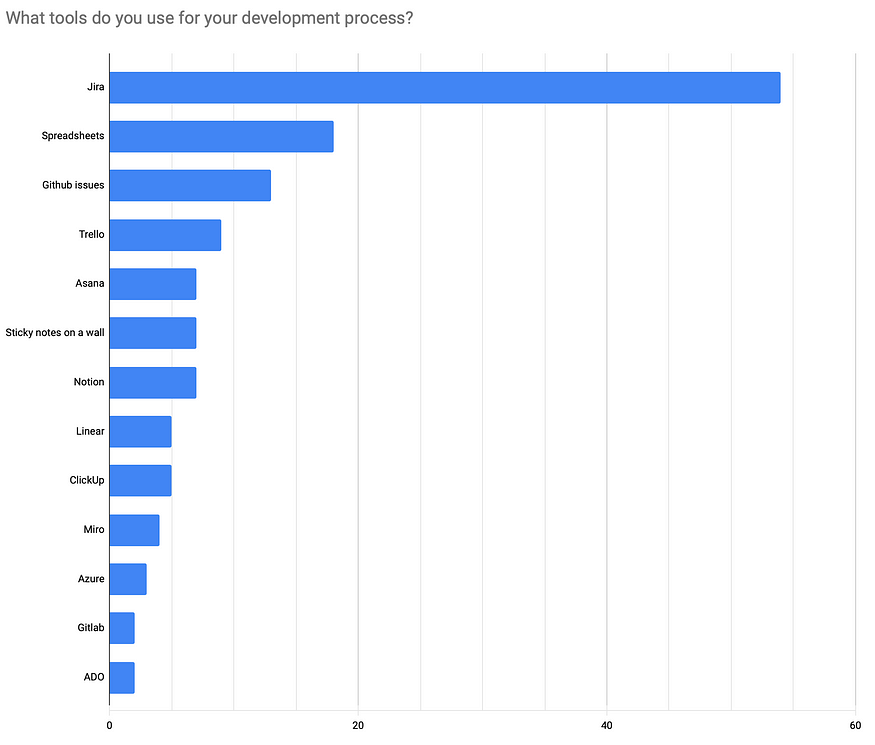

I recently ran a survey, asking people how they and their teams build software. I’ve compiled a summary of the results below.  
我最近进行了一项调查，询问人们他们和他们的团队如何构建软件。我在下面汇总了结果。

But first, I’d like to say a huge thanks to everyone who took the time to complete it!  
但首先，我要对所有花时间完成它的人表示衷心的感谢！

## Why I did this 我为什么这样做

I’m currently building Shaped: a lightweight [product development planner and tracker](https://getshaped.co/) for startups & small teams. I wanted to learn a little more about how teams approach software development today and where they are facing challenges.  
我目前正在构建Shapeped：一个轻量级的产品开发规划师和跟踪器，适用于初创公司和小型团队。我想更多地了解当今团队如何处理软件开发以及他们面临的挑战。

## The results

## Who completed the survey? 谁完成了调查？

The survey was completed by just shy of 100 people.  
这项调查由不到100人完成。

Most work in larger companies of more than 100 employees (which is not my target market, but there is some interesting data nonetheless).  
大多数人在员工超过100人的大公司工作（这不是我的目标市场，但仍然有一些有趣的数据）。

I took the opportunity to find out where teams are working and was a little surprised to discover the majority are still working remotely or hybridity (is that a word?). I had assumed that larger companies, at least, had started to head back into the office.  
我借此机会了解了团队在哪里工作，并惊讶地发现大多数人仍在远程工作或混合工作（这是一个词吗？我原以为，至少大公司已经开始回到办公室了。

A question I wished I had asked was: where in the world the company was located. It would have been interesting to see if there was any correlation between that and remote/hybrid/office work.  
我希望我问的一个问题是：公司位于世界的哪个地方。看看这与远程/混合/办公室工作之间是否存在任何相关性会很有趣。

Anyway, we now we have an idea of who these teams are. Onto the meat of the survey: how teams plan and develop software.  
无论如何，我们现在对这些团队是谁有了了解。调查的重点：团队如何计划和开发软件。

## Development planning process 发展规划过程

When it comes to planning what will be worked on by the development teams, most companies are using feature roadmaps. And it’s not just the big companies doing this — you can see a fairly even spread amongst all company sizes.  
在规划开发团队的工作时，大多数公司都在使用功能路线图。不仅仅是大公司这样做 - 你可以看到所有公司规模的分布相当均匀。

Feature roadmaps are the most popular technique. They can be seen as a little old-fashioned in this day and age. But leaders and stakeholders have a hard time letting them go, as it gives them a sense of clarity and control. The biggest flaw with ‘feature roadmaps’ is that they assume that the feature being planned is the right feature to build. They lock teams into building solutions that aren’t going to work and that leads to wasted effort.  
功能路线图是最流行的技术。在这个时代，它们可以被视为有点过时。但领导者和利益相关者很难让他们离开，因为这给了他们一种清晰和控制感。“功能路线图”的最大缺陷是，它们假设正在规划的功能是要构建的正确功能。他们将团队锁定在构建行不通的解决方案上，这会导致浪费精力。

Theme/outcome-based roadmaps came in fourth. This is similar planning technique to feature roadmaps but instead of planning “features to build” the business will plan “outcomes to achieve”. This subtle shift means that development teams are not being committed to specific features, but outcomes to hit. And the ownership moves to the teams to discover and build the right solutions.  
基于主题/结果的路线图排在第四位。这与功能路线图类似，但不是计划“要构建的功能”，而是计划“要实现的结果”。这种微妙的转变意味着开发团队不是致力于特定功能，而是要达到的结果。所有权转移到团队身上，以发现和构建正确的解决方案。

The concept of outcome-based roadmaps are not disimilar to OKRs, which is the same fundamental idea, but with more structure.  
基于结果的路线图的概念与 OKR 没有区别，后者是相同的基本思想，但具有更多的结构。

When it comes to startups, I typically advise that Now/Next/Later is a good framework for planning. Startups are typically changing direction a lot, as they learn new things and discover new opportunities. So restricting planning to what is happening Now, what are they going to do Next, and what things they might do Later is a helpful way to focus their limited resources.  
当谈到初创公司时，我通常建议现在/下一个/以后是一个很好的规划框架。初创公司通常会改变方向，因为他们学习新事物并发现新机会。因此，将计划限制在现在正在发生的事情，他们接下来要做什么，以及他们以后可能会做什么是集中有限资源的有用方法。

Most companies plan ahead in quarters. This is a sensible time frame that gives teams time to get stuck into chunky problems and deliver meaningful outcomes.  
大多数公司提前计划季度。这是一个合理的时间框架，让团队有时间陷入大块的问题并提供有意义的结果。

I am a little concerned about the one company that plans ahead for the next 5 years though!  
不过，我有点担心一家计划未来 5 年的公司！

In terms of satisfaction with their planning, it’s fairly evenly spread over the different company sizes. Though companies with 2–10 employees seem to have the advantage. At this stage of a company’s life, planning tends to be a simpler affair.  
就对他们的计划的满意度而言，它相当均匀地分布在不同的公司规模上。尽管拥有 2-10 名员工的公司似乎具有优势。在公司生命的这个阶段，计划往往是一件简单的事情。

There was no particular correlation between satisfaction and planning technique or how far ahead the planning was done.  
满意度与计划技术或计划提前完成的程度之间没有特别的相关性。

## Software development process 软件开发过程

When it comes to the development process teams use, Scrum is by far, the most popular methodology.  
当涉及到团队使用的开发过程时，Scrum是迄今为止最流行的方法。

“Mixture” comes next, which is where teams are use a mix of different techniques for their specific needs.  
接下来是“混合”，即团队根据其特定需求使用不同技术的混合。

Interestingly, the third most popular process was not to have a process at all. I can’t see how that work for larger companies!  
有趣的是，第三大最受欢迎的过程是根本没有过程。我看不出这对大公司有什么好处！

Shape Up is a relatively new methodology that comes from the team behind Basecamp. It’s a process that I’m excited about and I think works very well for startup teams. (Indeed, my product Shaped [supports Shape Up](https://getshaped.co/shape-up) out of the box).  
Shape Up是一种相对较新的方法，来自Basecamp背后的团队。这是一个令我兴奋的过程，我认为这对创业团队来说非常有效。（事实上，我的产品 形状 支持开箱即用的形状）。

No real surprise here, most teams work in 2-week cycles.  
这并不奇怪，大多数团队以 2 周为周期工作。

## Development tracking tools 开发跟踪工具

Jira is the software everyone _loves to hate_, but they all use it anyway! With Trello coming in fourth, it’s fair to say Atlassian have cornered a very good chunk of the market.  
Jira 是每个人都喜欢讨厌的软件，但他们无论如何都使用它！随着Trello排在第四位，可以公平地说，Atlassian已经占据了很大一部分市场。

What was more surprising was how many people use spreadsheets. I should note, however, that people were able to select multiple answers for this question. So this is **not** saying that some teams use spreadsheets as their sole software tool for planning and tracking.  
更令人惊讶的是有多少人使用电子表格。然而，我应该指出，人们能够为这个问题选择多个答案。因此，这并不是说某些团队使用电子表格作为计划和跟踪的唯一软件工具。

So there you have it, a snapshot of 100 or so companies and how they are currently developing software. I hope you found it interesting and/or useful. Let me know in the comments.  
所以你有它，100家左右公司的快照以及他们目前如何开发软件。我希望你觉得它有趣和/或有用。在评论中让我知道。

## About me: I’m James! 关于我：我是詹姆斯！

I’m a [**startup and product coach**](http://foundational.one/) with previous experience working in product, operations & engineering at various companies and startups.  
我是一名初创公司和产品教练，曾在多家公司和初创公司从事产品、运营和工程工作。

I realised that the current tools for planning & tracking product development are just too heavy and that’s why I’m building Shaped: a super-lightweight [**project management tool for startups**](https://getshaped.co/).  
我意识到目前用于规划和跟踪产品开发的工具太重了，这就是为什么我要构建Shapeped：一个面向初创公司的超轻量级项目管理工具。

Click the link to sign up for early access 👆  
单击链接注册抢先体验 👆
